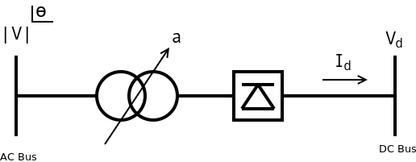

.. _ac_dc_derivatives:

Flujo de potencia AC/DC unificado
===================================

En esta sección vamos a desarrollar el flujo de potencia unificado AC/DC.

Las referencias que se han utilizado son [TYL1]_: Excelente artículo para comprender cómo componer el problema.
[ARR1]_ Libro de referencia del que se sacan las ecuaciones y se componen a la manera descrita por Tylavsky, pero
realizando las derivadas en forma matricial como se describe en [MAT1]_.

El modelo de convertidor que seguiremos es este:

Ecuaciones del modelo
------------------------------

B1) Ecuación de equilibrio de potencia en los nudos AC

.. math::

    S = V \cdot I_{bus, ac}^* + E \cdot I_d = V \cdot \left( Y \times V \right)^* + E \cdot I_d

B2) Ecuación de equilibrio de potencia en los nudos DC

.. math::

    P_d = V_d \cdot I_{bus, dc} - V_d \cdot I_d = V_d \cdot \left( G \times V_d \right) - V_d \cdot I_d

R1) Ecuación de equilibrio AC/DC en los convertidores

.. math::

    R1 = V_d - k_1 \cdot a \cdot |V| \cdot cos(\theta)

R2) Ecuación de equilibrio AC/DC en los convertidores

.. math::

    R2 = V_d - k_1 \cdot a \cdot |V| \cdot cos(\alpha) + \frac{3}{\pi} \cdot X_c \cdot I_d

R3)  Ecuación de control de potencia en los convertidores.

.. math::

    R3 = P^{sp} - V_d \cdot I_d

R4) Ecuación de control de tensión DC en los covertidores

.. math::

    R4 = V_d - V_d^{sp}

R5) Ecuación de control de correinte en los convertidores

.. math::

    R5 = I_d - I_d^{sp}

R6) Ecuación de control del ángulo de disparo en los convertidores

.. math::

    R6 = cos(\alpha) - cos(\alpha_{min})

R7) Ecuación de control del tap de los convertidores:

.. math::

    R7 = a - a^{sp}

.. list-table::
   :widths: 15 15 80
   :header-rows: 1

   * - Magnitud
     - Unidades
     - Descripción

   * - :math:`S`
     - p.u.
     - Vector de potencias complejas

   * - :math:`V`
     - p.u.
     - Vector de tensiones complejas

   * - :math:`|V|`
     - p.u.
     - Vector de módulos de tensiones

   * - :math:`\theta`
     - radianes
     - Vector de angulos de las tensiones

   * - :math:`Y`
     - p.u.
     - Matriz de admitancia AC

   * - :math:`I`
     - p.u.
     - Vector de inyecciones de corriente complejas

   * - :math:`E`
     - p.u.
     - Vector unitario de tensiones complejas

   * - :math:`I_d`
     - p.u.
     - Vector de corrientes de los convertidores

   * - :math:`I_d^{sp}`
     - p.u.
     - Vector de corrientes especificadas de los convertidores

   * - :math:`V_d`
     - p.u.
     - Vector de tensiones en los nudos DC

   * - :math:`V_d^{sp}`
     - p.u.
     - Vector de tensiones de control en los nudos DC

   * - :math:`G`
     - p.u.
     - Matriz de consuctancias en los nudos DC

   * - :math:`k_1`
     - p.u.
     - Vector de parámetros de los convertidores

   * - :math:`a`
     - p.u.
     - Vector de módulos de tap en los convertidores

   * - :math:`a^{sp}`
     - p.u.
     - Vector de módulos de tap de control en los convertidores

   * - :math:`cos(\alpha)`
     - p.u.
     - Vector de coseno del ángulo de disparo en los convertidores. Se toma todo junto como una variable.

   * - :math:`cos(\alpha_{min})`
     - p.u.
     - Vector de coseno del ángulo de disparo de control en los convertidores

   * - :math:`X_c`
     - p.u.
     - Vector de reactancias en los convertidores

   * - :math:`P^{sp}`
     - p.u.
     - Vector de potencias de control en los convertidores

Variables del modelo
----------------------------

Las variables son :math:`|V|`, :math:`\theta`, :math:`V_d`, :math:`I_d`, :math:`a`, :math:`cos(\alpha)`.

A la hora de realizar las derivadas podemos idetficar de antemano, las variables que componen cada ecuación:

+----+-------------+----------------+-------------+-------------+---------------------+-----------+
|    | :math:`|V|` | :math:`\theta` | :math:`V_d` | :math:`I_d` | :math:`cos(\alpha)` | :math:`a` |
+====+=============+================+=============+=============+=====================+===========+
| B1 | x           | x              |             | x           |                     |           |
+----+-------------+----------------+-------------+-------------+---------------------+-----------+
| B2 |             |                | x           | x           |                     |           |
+----+-------------+----------------+-------------+-------------+---------------------+-----------+
| R1 | x           | x              | x           |             |                     | x         |
+----+-------------+----------------+-------------+-------------+---------------------+-----------+
| R2 | x           |                | x           | x           | x                   | x         |
+----+-------------+----------------+-------------+-------------+---------------------+-----------+
| R3 |             |                | x           | x           |                     |           |
+----+-------------+----------------+-------------+-------------+---------------------+-----------+
| R4 |             |                | x           |             |                     |           |
+----+-------------+----------------+-------------+-------------+---------------------+-----------+
| R5 |             |                |             | x           |                     |           |
+----+-------------+----------------+-------------+-------------+---------------------+-----------+
| R6 |             |                |             |             | x                   |           |
+----+-------------+----------------+-------------+-------------+---------------------+-----------+
| R7 |             |                |             |             |                     | x         |
+----+-------------+----------------+-------------+-------------+---------------------+-----------+

Esta tabla nos ayudará a formar el Jacobiano posteriormente.

Derivadas
------------

Derivadas previas
^^^^^^^^^^^^^^^^^^^^^^^^^^^^^^^^^

.. math::

    \frac{\partial V}{\partial |V|} = [E], \quad  \frac{\partial V}{\partial \theta} = j [V]

.. math::

    \frac{\partial E}{\partial |V|} = [0], \quad \frac{\partial E}{\partial \theta} = j [E]

.. math::

    \frac{\partial I_{bus, ac}}{\partial |V|} = Y \times [E], \quad \frac{\partial I_{bus, ac}}{\partial \theta} = j Y \times [V]

.. math::

    \frac{\partial I_{bus, dc}}{\partial V_d} = G, \quad \frac{\partial I_{bus, dc}}{\partial I_d} = [0]

Derivadas de la ecuación B1
^^^^^^^^^^^^^^^^^^^^^^^^^^^^^^^^^

.. math::

    S = V \cdot I_{bus, ac}^* + E \cdot I_d

Depende de :math:`(\theta, |V|, I_d)`

.. math::

    \frac{\partial S}{\partial \theta} =  j \cdot [V] \cdot \left( I - Y \times [V] \right) ^* - j \cdot [I_d] \cdot  [E]

.. math::

    \frac{\partial S}{\partial |V|} =  [V] \cdot \left( Y \times [E] \right)^* + [I]^* \cdot [E] = [E] \cdot \left( Y \times [V] + [I] \right)^*

.. math::

    \frac{\partial S}{\partial I_d} = [E]

Derivadas de la ecuación B2
^^^^^^^^^^^^^^^^^^^^^^^^^^^^^^^^^

.. math::

    P_d = V_d \cdot I_{bus, dc} - V_d \cdot I_d

Depende de :math:`(V_d, I_d)`

.. math::

    \frac{\partial P_d}{\partial V_d} =  [V_d] \times G + G \times [V_d] - [I_d]

.. math::

    \frac{\partial P_d}{\partial I_d} =  -[V_d]

Derivadas de la ecuación R1
^^^^^^^^^^^^^^^^^^^^^^^^^^^^^^^^^

.. math::

    R1 = V_d - k_1 \cdot a \cdot |V| \cdot cos(\theta)

Depende de :math:`(|V|, \theta, V_d, a)`

.. math::

    \frac{\partial R1}{\partial |V|} = \frac{\partial V_d}{\partial |V|} -
                                        \left(k_1 \cdot a \cdot |V| \cdot \frac{\partial cos(\theta)}{\partial |V|}
                                        +     k_1 \cdot a \cdot \frac{\partial |V|}{\partial |V|} \cdot cos(\theta)
                                        +     k_1 \cdot \frac{\partial a}{\partial |V|} \cdot |V| \cdot cos(\theta) \right) \\
    = -k_1 \cdot a \cdot cos(\theta) \\
    = -k_1 \cdot a \cdot Re \{ [E] \}

.. math::

    \frac{\partial R1}{\partial \theta} = \frac{\partial V_d}{\partial \theta} -
                                        \left(k_1 \cdot a \cdot |V| \cdot \frac{\partial cos(\theta)}{\partial \theta}
                                        +     k_1 \cdot a \cdot \frac{\partial |V|}{\partial \theta} \cdot cos(\theta)
                                        +     k_1 \cdot \frac{\partial a}{\partial \theta} \cdot |V| \cdot cos(\theta) \right) \\
    = k_1 \cdot a \cdot sen(\theta) \\
    = k_1 \cdot a \cdot Im\{[E] \}

.. math::

    \frac{\partial R1}{\partial V_d} = \frac{\partial V_d}{\partial V_d} -
                                        \left( k_1 \cdot a \cdot |V| \cdot \frac{\partial cos(\theta)}{\partial V_d}
                                             + k_1 \cdot a \cdot \frac{\partial |V|}{\partial V_d} \cdot cos(\theta)
                                             + k_1 \cdot \frac{\partial a}{\partial V_d} \cdot |V| \cdot cos(\theta) \right) \\
    = [1]

.. math::

    \frac{\partial R1}{\partial a} = \frac{\partial V_d}{\partial a} -
                                        \left(k_1 \cdot a \cdot |V| \cdot \frac{\partial cos(\theta)}{\partial a}
                                        +     k_1 \cdot a \cdot \frac{\partial |V|}{\partial a} \cdot cos(\theta)
                                        +     k_1 \cdot \frac{\partial a}{\partial a} \cdot |V| \cdot cos(\theta) \right) \\
    = k_1 \cdot |V| \cdot cos(\theta) \\
    = k_1 \cdot |V| \cdot Re\{[V] \}

Derivadas de la ecuación R2
^^^^^^^^^^^^^^^^^^^^^^^^^^^^^^^^^

.. math::

    R2 = V_d - k_1 \cdot a \cdot |V| \cdot cos(\alpha) + \frac{3}{\pi} \cdot X_c \cdot I_d

Depende de :math:`(|V|, V_d, I_d, a, cos(\alpha))`

.. math::

    \frac{\partial R2}{\partial |V|} = \frac{\partial V_d}{\partial |V|}
                                     - \left( k_1 \cdot \frac{\partial a}{\partial |V|} \cdot |V| \cdot cos(\alpha)
                                           +  k_1 \cdot a \cdot \frac{\partial |V|}{\partial |V|} \cdot cos(\alpha)
                                           +  k_1 \cdot a \cdot |V| \cdot \frac{\partial cos(\alpha)}{\partial |V|} \right)
                                     + \frac{3}{\pi} \cdot X_c \cdot \frac{\partial I_d}{\partial |V|} \\
                                    = -k_1 \cdot a \cdot cos(\alpha)

.. math::

    \frac{\partial R2}{\partial V_d} = \frac{\partial V_d}{\partial V_d}
                                     - \left( k_1 \cdot \frac{\partial a}{\partial V_d} \cdot |V| \cdot cos(\alpha)
                                           +  k_1 \cdot a \cdot \frac{\partial |V|}{\partial V_d} \cdot cos(\alpha)
                                           +  k_1 \cdot a \cdot |V| \cdot \frac{\partial cos(\alpha)}{\partial V_d} \right)
                                     + \frac{3}{\pi} \cdot X_c \cdot \frac{\partial I_d}{\partial V_d} \\
                                    = [1]

.. math::

    \frac{\partial R2}{\partial I_d} = \frac{\partial V_d}{\partial I_d}
                                     - \left( k_1 \cdot \frac{\partial a}{\partial I_d} \cdot |V| \cdot cos(\alpha)
                                           +  k_1 \cdot a \cdot \frac{\partial |V|}{\partial I_d} \cdot cos(\alpha)
                                           +  k_1 \cdot a \cdot |V| \cdot \frac{\partial cos(\alpha)}{\partial I_d} \right)
                                     + \frac{3}{\pi} \cdot X_c \cdot \frac{\partial I_d}{\partial I_d} \\
                                    = \frac{3}{\pi} \cdot X_c

.. math::

    \frac{\partial R2}{\partial a} = \frac{\partial V_d}{\partial a}
                                     - \left( k_1 \cdot \frac{\partial a}{\partial a} \cdot |V| \cdot cos(\alpha)
                                           +  k_1 \cdot a \cdot \frac{\partial |V|}{\partial a} \cdot cos(\alpha)
                                           +  k_1 \cdot a \cdot |V| \cdot \frac{\partial cos(\alpha)}{\partial a} \right)
                                     + \frac{3}{\pi} \cdot X_c \cdot \frac{\partial I_d}{\partial a} \\
                                    = -k_1 \cdot |V| \cdot cos(\alpha)

.. math::

    \frac{\partial R2}{\partial cos(\alpha)} = \frac{\partial V_d}{\partial cos(\alpha)}
                                     - \left( k_1 \cdot \frac{\partial a}{\partial cos(\alpha)} \cdot |V| \cdot cos(\alpha)
                                           +  k_1 \cdot a \cdot \frac{\partial |V|}{\partial cos(\alpha)} \cdot cos(\alpha)
                                           +  k_1 \cdot a \cdot |V| \cdot \frac{\partial cos(\alpha)}{\partial cos(\alpha)} \right)
                                     + \frac{3}{\pi} \cdot X_c \cdot \frac{\partial I_d}{\partial cos(\alpha)} \\
                                    = -k_1 \cdot a \cdot |V|

Derivadas de la ecuación R3
^^^^^^^^^^^^^^^^^^^^^^^^^^^^^^^^^

.. math::

    R3 = P^{sp} - V_d \cdot I_d

Depende de :math:`(V_d, I_d)`

.. math::

    \frac{\partial R3}{\partial V_d} = \frac{\partial P^{sp}}{\partial V_d}
                                       - \left( \frac{\partial V_d}{\partial V_d} \cdot I_d
                                              + V_d \cdot \frac{\partial I_d}{\partial V_d} \right) \\
                                    = -[I_d]

.. math::

    \frac{\partial R3}{\partial I_d} = \frac{\partial P^{sp}}{\partial I_d}
                                       - \left( \frac{\partial V_d}{\partial I_d} \cdot I_d
                                              + V_d \cdot \frac{\partial I_d}{\partial I_d} \right) \\
                                    = -[V_d]

Derivadas de la ecuación R4
^^^^^^^^^^^^^^^^^^^^^^^^^^^^^^^^^

.. math::

    R4 = V_d - V_d^{sp}

.. math::

    \frac{\partial R4}{\partial V_d} = [1]

Derivadas de la ecuación R5
^^^^^^^^^^^^^^^^^^^^^^^^^^^^^^^^^

.. math::

    R5 = I_d - I_d^{sp}

.. math::

    \frac{\partial R5}{\partial I_d} = [1]

Derivadas de la ecuación R6
^^^^^^^^^^^^^^^^^^^^^^^^^^^^^^^^^

.. math::

    R6 = cos(\alpha) - cos(\alpha_{min})

.. math::

    \frac{\partial R6}{\partial cos(\alpha)} = [1]

Derivadas de la ecuación R7
^^^^^^^^^^^^^^^^^^^^^^^^^^^^^^^^^

.. math::

    R7 = a - a^{sp}

.. math::

    \frac{\partial R7}{\partial a} = [1]

Sistema de ecuaciones iterativo
-----------------------------------------

Abajo tenemos el sistema de ecuaciones que hay que resolver iterativamente para resolver una Red AC/DC.

Nótese que las derivadas en las posiciones 11, 12, 21 y 22 son el tradicional jacobiano AC con alguna modificación.
El resto representa el flujo de potencia DC y derivadas concernientes a los convertidores.

.. math::

    \begin{bmatrix}
    Re \left( \frac{\partial B1}{\partial \theta} \right) & 	Re \left( \frac{\partial B1}{\partial |V|} \right) & 	0 & 	Re \left( \frac{\partial B1}{\partial I_d} \right) & 	0 & 	0 & 	\\
    Im \left( \frac{\partial B1}{\partial \theta} \right) & 	Im \left( \frac{\partial B1}{\partial |V|} \right) & 	0 & 	Im \left( \frac{\partial B1}{\partial I_d} \right) & 	0 & 	0 & 	\\
    0 & 	0 & 	\frac{\partial B2}{\partial V_d} & 	\frac{\partial B2}{\partial I_d} & 	0 & 	0 & 	\\
    \frac{\partial R1}{\partial \theta} & 	\frac{\partial R1}{\partial |V|} & 	\frac{\partial R1}{\partial V_d} & 	0 & 	0 & 	\frac{\partial R1}{\partial a} & 	\\
    0 & 	\frac{\partial R2}{\partial |V|} & 	\frac{\partial R2}{\partial V_d} & 	\frac{\partial R2}{\partial I_d} & 	\frac{\partial R2}{\partial cos(\alpha)} & 	\frac{\partial R2}{\partial a} & 	\\
    0 & 	0 & 	\frac{\partial R3}{\partial V_d} & 	\frac{\partial R3}{\partial I_d} & 	0 & 	0 & 	\\
    0 & 	0 & 	\frac{\partial R4}{\partial V_d} & 	0 & 	0 & 	0 & 	\\
    0 & 	0 & 	0 & 	\frac{\partial R5}{\partial I_d} & 	0 & 	0 & 	\\
    0 & 	0 & 	0 & 	0 & 	\frac{\partial R6}{\partial cos(\alpha)} & 	0 & 	\\
    0 & 	0 & 	0 & 	0 & 	0 & 	\frac{\partial R7}{\partial a} &
    \end{bmatrix} \times \begin{bmatrix}
    \theta \\
    |V| \\
    V_d \\
    I_d \\
    cos(\alpha) \\
    a
    \end{bmatrix} = \begin{bmatrix}
    \Delta P \\
    \Delta Q \\
    \Delta P_d \\
    \Delta R1 \\
    \Delta R2 \\
    \Delta R3 \\
    \Delta R4 \\
    \Delta R5 \\
    \Delta R6 \\
    \Delta R7
    \end{bmatrix}

Aquí viene la parte realmente interesante de este problema; Ves que el Jacobiano tiene 6 columnas y 10 filas?
Esto puede llevar a confusiones. Una vez compuesto el Jacobiano, este tendrá el mismo número de filas que de columnas
pero durante su composición no todas las ecuaciones se aplican a todos los dispositivos.
Las ecuaciones R3, R4, R5, R6 y R7 son
ecuaciones opcionales de control y sólo una de ellas aplica por cada convertidor. Entonces, dependiendo del tipo
de control, se elige una de las ecuaciones. No obstante, para mantener la cordura, agruparemos por bloques como
hemos definido.

.. list-table::
   :widths: 15 40 35 20
   :header-rows: 1

   * - Derivada
     - Valor
     - Filas
     - columnas

   * - :math:`Re \left( \frac{\partial B1}{\partial \theta} \right)`
     - :math:`j \cdot [V] \cdot \left( I - Y \times [V] \right) ^* - j \cdot [I_d] \cdot  [E]`
     - :math:`\Delta P` (pqpv)
     - :math:`\theta` (pqpv)

   * - :math:`Re \left( \frac{\partial B1}{\partial |V|} \right)`
     - :math:`[E] \cdot \left( Y \times [V] + [I] \right)^*`
     - :math:`\Delta P` (pqpv)
     - :math:`|V|` (pq)

   * - :math:`Re \left( \frac{\partial B1}{\partial I_d} \right)`
     - :math:`[E]`
     - :math:`\Delta P` (pqpv)
     - :math:`I_d` (conv)

   * - :math:`Im \left( \frac{\partial B1}{\partial \theta} \right)`
     - :math:`j \cdot [V] \cdot \left( I - Y \times [V] \right) ^* - j \cdot [I_d] \cdot  [E]`
     - :math:`\Delta Q` (pq)
     - :math:`\theta` (pqpv)

   * - :math:`Im \left( \frac{\partial B1}{\partial |V|} \right)`
     - :math:`[E] \cdot \left( Y \times [V] + [I] \right)^*`
     - :math:`\Delta Q` (pq)
     - :math:`|V|` (pq)

   * - :math:`Im \left( \frac{\partial B1}{\partial I_d} \right)`
     - :math:`[E]`
     - :math:`\Delta Q` (pq)
     - :math:`I_d` (conv)

   * - :math:`\frac{\partial B2}{\partial V_d}`
     - :math:`[V_d] \times G + G \times [V_d] - [I_d]`
     - :math:`P_d` (dc)
     - :math:`V_d` (dc)

   * - :math:`\frac{\partial B2}{\partial I_d}`
     - :math:`-[V_d]`
     - :math:`P_d` (dc)
     - :math:`I_d` (conv)

   * - :math:`\frac{\partial R1}{\partial \theta}`
     - :math:`[k_1 \cdot a] \cdot Im\{[E] \}`
     - :math:`R1` (conv)
     - :math:`\theta` (conv-ac)

   * - :math:`\frac{\partial R1}{\partial |V|}`
     - :math:`-[k_1 \cdot a] \cdot Re \{ [E] \}`
     - :math:`R1` (conv)
     - :math:`|V|` (conv-ac)

   * - :math:`\frac{\partial R1}{\partial V_d}`
     - :math:`[1] \rightarrow C_t`
     - :math:`R1` (conv)
     - :math:`V_d` (conv)

   * - :math:`\frac{\partial R1}{\partial a}`
     - :math:`k_1 \cdot |V| \cdot Re\{[V] \}`
     - :math:`R1` (conv)
     - :math:`a` (conv)

   * - :math:`\frac{\partial R2}{\partial |V|}`
     - :math:`-k_1 \cdot a \cdot cos(\alpha)`
     - :math:`R2` (conv)
     - :math:`|V|` (conv-ac)

   * - :math:`\frac{\partial R2}{\partial V_d}`
     - :math:`[1] \rightarrow C_t`
     - :math:`R2` (conv)
     - :math:`V_d` (conv)

   * - :math:`\frac{\partial R2}{\partial I_d}`
     - :math:`\frac{3}{\pi} \cdot X_c`
     - :math:`R2` (conv)
     - :math:`V_d` (conv)

   * - :math:`\frac{\partial R2}{\partial cos(\alpha)}`
     - :math:`-k_1 \cdot a \cdot |V|`
     - :math:`R2` (conv)
     - :math:`cos(\alpha)` (conv)

   * - :math:`\frac{\partial R2}{\partial a}`
     - :math:`-k_1 \cdot |V| \cdot cos(\alpha)`
     - :math:`R2` (conv)
     - :math:`a` (conv)

   * - :math:`\frac{\partial R3}{\partial V_d}`
     - :math:`-[I_d]`
     - :math:`R3` (conv con control de :math:`P_d`)
     - :math:`V_d` (conv)

   * - :math:`\frac{\partial R3}{\partial I_d}`
     - :math:`-[V_d]`
     - :math:`R3` (conv con control de :math:`P_d`)
     - :math:`I_d` (conv)

   * - :math:`\frac{\partial R4}{\partial V_d}`
     - :math:`[1]`
     - :math:`R4` (conv con control de :math:`V_d`)
     - :math:`V_d` (conv)

   * - :math:`\frac{\partial R5}{\partial I_d}`
     - :math:`[1]`
     - :math:`R5` (conv con control de :math:`I_d`)
     - :math:`I_d` (conv)

   * - :math:`\frac{\partial R6}{\partial cos(\alpha)}`
     - :math:`[1]`
     - :math:`R6` (conv con control de :math:`cos(\alpha)`)
     - :math:`cos(\alpha)` (conv)

   * - :math:`\frac{\partial R7}{\partial a}`
     - :math:`[1]`
     - :math:`R7` (conv, con control de :math:`a`)
     - :math:`a` (conv)

Referencias
-------------------

.. [ARR1] : Computer Analysis of power systems, Jos Arrillaga and C.P Arnold. Wyley 1990.
.. [TYL1] : A Simple Approach to the Solution of the ac-dc Power Flow Problem, Daniel Tylavsky, IEEE TRANSACTIONS ON EDUCATION, VOL. E-27, NO. 1, FEBRUARY 1984
.. [MAT1] : AC Power Flows, Generalized OPF Costs and their Derivatives using Complex Matrix Notation. Ray D. Zimmerman.