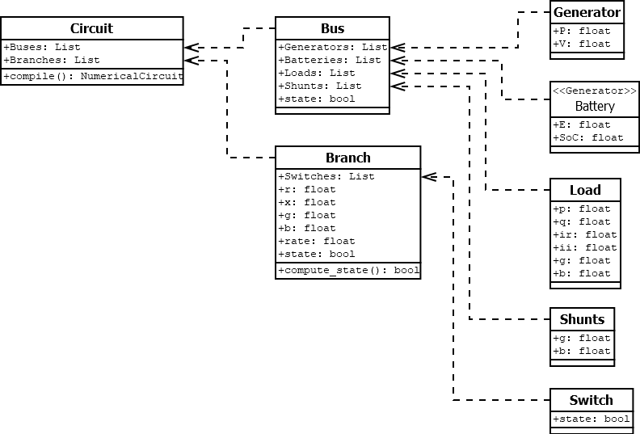
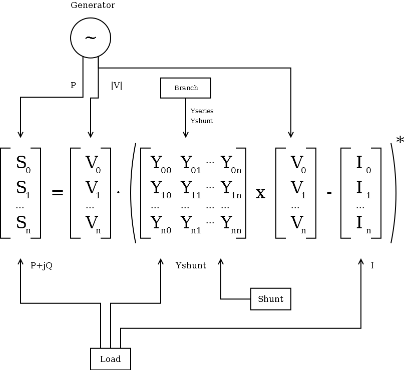
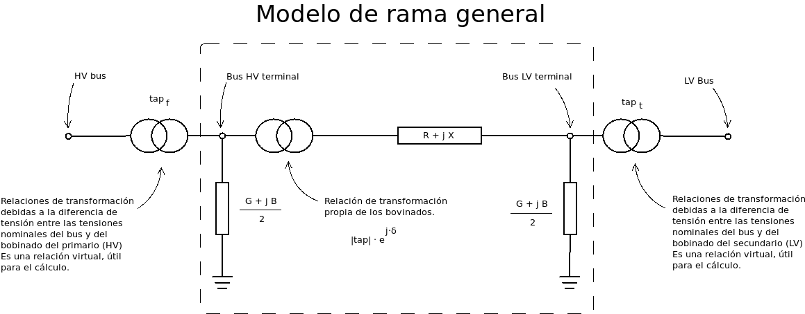
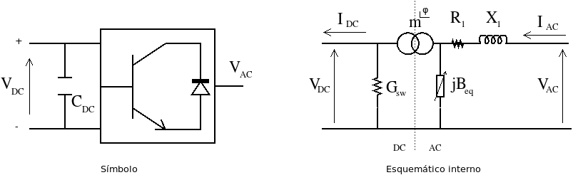
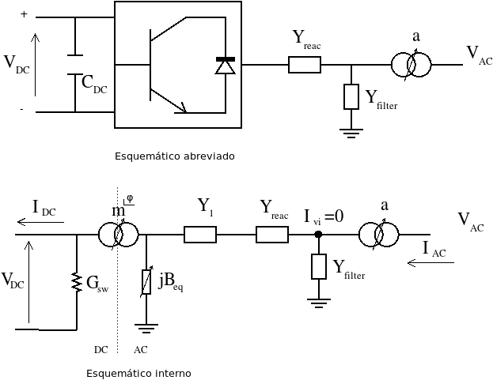

Dispositivos de la red
================================

.. _circuit_as_asset_manager:

El circuito como gestor de activos
-------------------------------------------------

En este documento se presenta un arreglo de la información de la red que resuta ser eficiente y mantenible para su
implementación en un programa de ordenador. El concepto principal es la agregación de los dispositivos de acuerdo
a su agregación natural. Es decir, si una carga se modela conectada a un bus, es natural que en el bus haya una lista
con las cargas conectadas, en lugar de que ambos dispositivos se almacenen de forma independiente. Esta agregación
hace que añadir y borrar elementos sea muy sencillo. Además el procesado y acceso a la información se produce de
forma inmediata.

Los conceptos son los siguientes:

- El circuito es el gestor de activos principal. Es la "caja" dónde se encuentra todo.

- El circuito sólo almacena buses y ramas.

- Los dispositivos de inyeccion tales como generadores y cargas se almacenan dentro del bus al que están conectados.

- Los interruptores se almacenan dentro de la rama a la que afectan.

El la sección ":ref:`compiling_the_asset_manager`" vemos cómo se convierte la información del gestor de activos, a
vectores y matrices que están preparadas para el cálculo.

.. _system_equation:

Ecuación del sistema
-----------------------------------------
La ecuación que relaciona las cargas con las tensiones en estado estacionario es la siguiente:

.. math::

    [S] = [V] \cdot \left( [Y] \times [V] - [I] \right)

La influencia de cada dispositivo sobre la ecuación es tal que las cargas tipo ZIP afectan al vector de potencia
compleja :math:`S`, el vector de correinte compleja :math:`I`, y la diagonal de la matriz de admitancia :math:`Y`.
Los generadores controlados afectan a la potencia real :math:`P`, y el módulo de la tensión :math:`|V|`.
Las baterías se consideran igual que generadores de tensión controlada. Los elementos shunt, afectan a la diagonal
de la matriz de admitancia :math:`Y`. Las ramas generales componen la matriz de admitancia :math:`Y`.

Bus
---------

El bus es el lugar topológico de conexión de los elementos de la red eléctrica. Tal como se propuso en
:ref:`circuit_as_asset_manager`, el Bus es un contenedor para los elementos de generación y carga de la red.

.. list-table::
   :widths: 55 20
   :header-rows: 1

   * - Valor
     - Unidades

   * - Tensión nominal (:math:`V_{nom}`)
     - kV

.. _pi_model:

Modelo general de rama  (Pi)
-----------------------------------------

A efectos de la mayoría de cálculos en estado estacionario, los elementos rama de la red se representan con el
denominado modelo :math:`\Pi` (Pi). Para cálculos en régimen estacionario, casi cualquier elemento que conecte dos
nudos de la red se puede representar con el denominado modelo :math:`\Pi`.

En el modelo pi, usa una admitancia serie () para representar la caída de tensión debida a la resistencia e
inductancia de los cables y una admitancia de acoplamiento con el suelo () que se divide en dos admitancias
conectadas a cada nudo en ambos extremos del elemento.
La representación matricial del modelo es:

.. math::

    \begin{bmatrix}
    I_f\\
    I_t
    \end{bmatrix}
    =\begin{bmatrix}
    Y_{ff} & Y_{ft}\\
    Y_{tf} & Y_{tt}
    \end{bmatrix}
    \times
    \begin{bmatrix}
    V_f\\
    V_t
    \end{bmatrix}

Dónde:

    :math:`I_f`: Vector de corrientes del lado primario.

    :math:`I_t`: Vector de corrientes del lado secundario.

    :math:`V_f`: Vector de tensiones del lado primario.

    :math:`V_t`: Vector de tensiones del lado secundario.

    :math:`Y_{ff}`: Matriz 3x3 de admitancia del lado primario.

    :math:`Y_{ft}`: Matriz 3x3 de admitancia del lado primario con el secundario.

    :math:`Y_{tf}`: Matriz 3x3 de admitancia del lado secundario con el primario.

    :math:`Y_{tt}`: Matriz 3x3 de admitancia del lado secundario.

La gran mayoría de algoritmos de cálculo, especialmente aquellos que son competitivos computacionalmente requieren
de una matriz de admitancias entre los nudos de la red. Hallando el modelo Pi correspondiente para cada rama, es
inmediata la formación de la matriz de admitancia de un circuito. Esto se discute detalladamente en el siguiente
capítulo.

.. list-table::
   :widths: 55 20
   :header-rows: 1

   * - Valor
     - Unidades

   * - Bus 1
     - Bus

   * - Bus 2
     - Bus

   * - Resistencia serie (:math:`r`)
     - p.u.

   * - Reactancia serie (:math:`x`)
     - p.u.

   * - Conductancia shunt (:math:`g`)
     - p.u.

   * - Susceptancia shunt (:math:`b`)
     - p.u.

Generadores de tensión controlada
-----------------------------------------

El generador controlado es una entelequia numérica que a efectos de cálculo sólo necesita que se especifiquen la
potencia activa (P) y el módulo de la tensión (:math:`|V|`).
La ventaja es que en el nodo en el que está conectado el generador, se mantiene el módulo de la tensión se
mantienen constante.

.. list-table::
   :widths: 55 20
   :header-rows: 1

   * - Valor
     - Unidades

   * - Potencia activa  (:math:`P_{set}`)
     - MW

   * - Impedancia
     - :math:`\Omega`

   * - Tensión de control (:math:`V_{set}`)
     - p.u.

   * - Máxima potencia reactiva  (:math:`Q_{max}`)
     - MVAr

   * - Mínima potencia reactiva  (:math:`Q_{min}`)
     - MVAr

El valor de tensión de control se especifica en valores por unidad con respecto a la tensión nominal del nodo.
La potencia activa especificada y la impedancia se han de pasar a valores por unidad. Adicionalmente se calcula la
potencia reactiva del generador. Si esta potencia reactiva calculada en valores por unidad excede los límites del
generador, en el proceso de cálculo se toman medidas como dejar de controlar la tensión en el nodo.

Baterías
-----------------------------------------

La betería es un elemento que sustrae o inyecta potencia en cada momento. En la literatura reciente y círculos
especializados, se sugiere que las baterías sean simuladas como generadores controlados dónde la potencia activa
P puede ser positiva o negativa, dependiendo de si se inyecta o sustrae potencia de la red. En este documento vamos
a aceptar esa sugerencia de modelado.

.. list-table::
   :widths: 55 20
   :header-rows: 1

   * - Valor
     - Unidades

   * - Potencia activa  (:math:`P_{set}`)
     - MW

   * - Impedancia
     - :math:`\Omega`

   * - Capacidad  (:math:`E`)
     - MWh

   * - Estado de carga  (:math:`SoC`)
     - p.u.

   * - Tensión de control  (:math:`V_{set}`)
     - p.u.

   * - Máxima potencia reactiva  (:math:`Q_{max}`)
     - MVAr

   * - Mínima potencia reactiva  (:math:`Q_{min}`)
     - MVAr

Al modelar la batería como un tipo especial de generador controlado, asumimos lo mismo que ya se ha asumido en éste.
Adicionalmente incluimos el parámetro de la capacidad de almacenaje de la batería que nos permitirá determinar el
nivel de descarga (:math:`SoC`) de ésta en simulaciones tiempo-dependientes.

Cargas: Modelo general ZIP
-----------------------------------------

Para modelar una carga de una red eléctrica, se utiliza el denominado modelo ZIP. El modelo  está compuesto por una
impedancia (Z), una corriente (I) y una potencia (P). Estrictamente las siglas ZIP no representan las magnitudes.
La potencia es un valor complejo (S) de potencia activa y reactiva. La corriente es un valor complejo con corriente
activa y reactiva y la impedancia es efectivamente una impedancia compleja con valores real e imaginario.

.. list-table::
   :widths: 40 40
   :header-rows: 1

   * - Valor
     - Unidades

   * - Potencia (:math:`P + jQ`)
     - MW + jMVAr

   * - Admitancia a V=1.pu.  (:math:`G + jB`)
     - MW + jMVAr

   * - Corriente a V=1.pu.  (:math:`Ir + jIi`)
     - MW + jMVAr

Todas las magnitudes se han de pasar a valores por unidad.

Elementos shunt
-----------------------------------------

Los elementos shunt son admitancias de la red. A decir verdad el modelo ZIP ya cubre una impendancia general.
No obstante es conveniente incluir los shunt como dispositivos generales porque se puede incluir un cambiador de tomas
variable para cambiar la impedancia en el "bucle exterior" del flujo de potencia, al igual que in cambiador de tomas de
un transformador.

.. list-table::
   :widths: 40 40
   :header-rows: 1

   * - Valor
     - Unidades

   * - Admitancia a V=1.pu. (:math:`G + jB`)
     - MW + jMVAr

¿Qué hacemos con los interruptores?
-----------------------------------------

Los interruptores son una parte fundamental de las redes eléctricas. Sin embargo su modelado numérico
es problemático. Si modelásemos los interruptores como una rama con impedancia zero o *infinita* entre dos buses,
estaríamos metiendo ramas de impedancia muy baja o muy alta en comparación con las demás ramas. En la práctica esto
produce admitancias que al ser insertadas en la matriz de admitancia producen lo que se denomina como
*mal condicionamiento* de la matriz. Esto produce que el problema numérico no tenga solución al tender a la divergencia.

Para evitar este problema los interruptores se han de pre-processar como los estados de las ramas a las que afectan.
Esto hace que la rama esté activada o desactivada evitando los problemas numericos por completo.

Por ejemplo en la imagen anterior, tenemos una línea con dos interruptores. Uno en cada cabecera. El interruptor unido
al bus 2 está abierto, provocando que la línea esté desconectada. Entoncen a la hora de componer las matrices de
admitancia (en el siguiente capítulo) simplemente le asignamos el estado *0* a la línea. Si estuviese conectada le
asignamos el estado *1*.

De forma general podemos decir que el estado de una línea es el producto de los estados binarios de los interruptores
que le afectan. En nuestro ejemplo el estado es el producto de 1 x 0 = 0, es decir que el estado de la rama es
desconectado.

Voltage source converter (VSC)
------------------------------------------

Se puede pensar en este dispositivo como una "rama" que convierte AC en DC.
El siguiente modelo de convertidor de fuente de tensión (o VSC) viene referenciado de [ACHA1]_.

La función de transferencia es la siguiente:

.. math::

    \begin{bmatrix}
    I_{ac}\\
    I_{dc}
    \end{bmatrix}
    =\begin{bmatrix}
    Y_{1} & -m \cdot e^{j \phi} \cdot Y_1 \\
    -m \cdot e^{-j \phi} \cdot Y_1 & G_{sw} + m^2 \cdot (Y_{1} + jB_{eq})
    \end{bmatrix}
    \times
    \begin{bmatrix}
    V_{ac}\\
    V_{dc}
    \end{bmatrix}

Dónde:

.. list-table::
   :widths: 10 70
   :header-rows: 1

   * - Variable
     - Significado

   * - :math:`R_1`
     - Pérdidas resistivas.

   * - :math:`X_1`
     - Pérdidas por interferencias magnéticas del convertidor.

   * - :math:`m`
     - Toma virtual. Equivale a :math:`\sqrt 3 / 2` veces la amplitud de modulación del convertidor.
       El rango de valores va de 0 a :math:`\sqrt 3 / 2`, aunque un límite inferior realista es 0,5.

   * - :math:`\phi`
     - Ángulo de disparo del convertidor.

   * - :math:`G_{sw}`
     - Pérdidas de operación del inversor.

.. math::

    Y_1 = \frac{1}{R_{1} + j X_{1}}

Alta tensión en corriente continua (HVDC)
------------------------------------------------------

High Voltage Direct Current o HVDC es un término utilizado para referirse a la transmisión en alta tensión y corriente
continua. Este método abarata costes para transmisión a muy larga distancia y también se usa para acoplar systemas
eléctricos con diferente base de fecuencia o que por distintas razones, su acople en AC es inestable. [ACHA2]_ provee
un marco de referencia unificado para incorporar los convertidores y las redes en DC en los flujos de potencia tipo
Newton-Raphson.

En [ACHA2]_ se proveen dos ecuaciones de transferencia que vamos a tener que unir. Estas son, la ecuación de
transferencia del transformador:

.. math::

    \begin{bmatrix}
    I_{AC}\\
    I_{vi}
    \end{bmatrix}
    =\begin{bmatrix}
    Y_{T} & a \cdot Y_{T}\\
    -a \cdot Y_{T} & a^2 \cdot Y_{T}
    \end{bmatrix}
    \times
    \begin{bmatrix}
    V_{AC}\\
    V_{vi}
    \end{bmatrix}

Y la ecuación de transferencia del convertidor VSC:

.. math::

    \begin{bmatrix}
    I_{vi}\\
    I_{DC}
    \end{bmatrix}
    =\begin{bmatrix}
    Y_{vi, vi} & Y_{vi, i}^{\phi}\\
     Y_{vi, i}^{-\phi} & Y_{i, i}
    \end{bmatrix}
    \times
    \begin{bmatrix}
    V_{vi}\\
    V_{DC}
    \end{bmatrix}

Dónde:

.. math::

    Y_{vi, vi} = \frac{Y_{filter} + Y_1 \cdot Y_{reac}}{Y_1 + Y_{reac}}

.. math::

    Y_{vi, i} = \frac{-k_1 \cdot m \cdot  Y_1 \cdot Y_{reac}}{Y_1 + Y_{reac}}

.. math::

    Y_{i, i} = \frac{G_{sw} + j \cdot k_1^2 \cdot m^2 \cdot B_{eq} + k_1^2 \cdot m^2 \cdot Y_1 \cdot Y_{reac}}{Y_1 + Y_{reac}}

.. math::

    G_{sw} = G_0 \cdot \left( \frac{|I_{ti}|}{I_{nom}} \right)^2

Como necesitamos una función de transferencia de la parte AC a la parte DC, necesitamos unir ambas funciones de
transferencia y eliminar las referencias a :math:`I_{vi}` y :math:`V_{vi}`.

.. math::

    \begin{bmatrix}
    I_{AC}\\
    I_{DC}\\
    I_{vi}
    \end{bmatrix}
    =\begin{bmatrix}
    Y_{T}          & 0                & -a \cdot Y_{T}\\
    -a \cdot Y_{T} & Y_{vi, i}^{\phi} & a^2 \cdot Y_{T} + Y_{vi, vi}\\
    0              & Y_{i, i}         & Y_{vi, i}^{-\phi}
    \end{bmatrix}
    \times
    \begin{bmatrix}
    V_{AC}\\
    V_{DC}\\
    V_{vi}
    \end{bmatrix}

Referencias
---------------

.. [ACHA1] A New STATCOM Model for Power Flows Using the Newton-Raphson Method. Enrique Acha, Behzad Kazemtabrizi.

.. [ACHA2] A generalized frame or reference for the incorporation of multi-terminal VSC-HVDC systems in power flow solutions. Enrique Acha, Luis M. Castro.