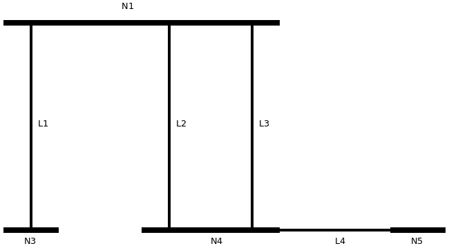

Modelo topológico
===============================

El motor de topología de un programa de cálculo eléctrico es una de las partes menos explicadas y más importantes.
Este capítulo explica el motor topológico desarrollado para el software `GridCal <https://github.com/SanPen/GridCal>`_.

De forma general, un motor de topología se encarga de preparar los datos para que puedan
ser usados en la :ref:`system_equation`. Los pasos necesarios para conseguirlo son:

- Convertir los datos de los activos a vectores de inyección de potencia, corriente y admitancia.

- Calcular las matrices de admitancia.

- Detectar las islas, determinando los índices de los buses y las ramas pertenecientes a cada isla.

- Separar los vectores de inyección y las matrices de admitancia de acuerdo a sus islas. Este paso es necesario poque
  si existen islas, una matriz de admitancia que represente más de una isla es singular (no tiene inversa) y por tanto
  no podrá ofrecer una solución de cálculo. La solución es particionar la matriz y los vectores asociados.

.. _compiling_the_asset_manager:

Compilando la información del gestor de activos
-------------------------------------------------------------

En la sección :ref:`circuit_as_asset_manager` se menciona la estructura anidada de objectos que componen la estructura
de la red. Esta estructura ha sido refinada con experiencia en diseño de simuladores eléctricos de forma que el paso
de la información en objetos a vectores y matrices sea eficiente y sencillo de comprender y mantener.

El siguiente pseudo-código ilustra la función de compilación de objetos a vectores y matrices.

.. code:: text

    n = circuit.buses.size()
    m = circuit.branches.size()
    bus_dict = dictionary<int, Bus>

    // contar los elementos, esto es bastante rápido
    nl = 0  // número de cargas
    ng = 0  // número de generadores
    nb = 0  // número de baterías
    ns = 0  // número de shunts

    for i=0:n
        nl += circuit.buses[i].loads.size()
        ng += circuit.buses[i].generators.size()
        nb += circuit.buses[i].batteries.size()
        ns += circuit.buses[i].shunts.size()

    // declarar arrays numéricos

    // cargas
    Pl = zeros(nl)
    Ql = zeros(nl)
    Irl = zeros(nl)
    Iil = zeros(nl)
    Gl = zeros(nl)
    Bl = zeros(nl)
    C_bus_load = zeros(n, nl)

    // Generadores
    Pg = zeros(ng)
    Vg = ones(ng)
    C_bus_gen = zeros(n, ng)

    // baterías
    Pb = zeros(nb)
    Vb = ones(nb)
    C_bus_batt = zeros(n, nb)

    // shunts
    Gs = zeros(ns)
    Bs = zeros(ns)
    C_bus_shunt = zeros(n, ns)

    il = 0, ig = 0, ib = 0, is = 0
    for i=0:n

        for k=0:circuit.buses[i].loads.size()  // recoger los valores de las cargas
            Pl[il] = circuit.buses[i].loads[k].Pl
            Ql[il] = circuit.buses[i].loads[k].Ql
            Irl[il] = circuit.buses[i].loads[k].Ir
            Iil[il] = circuit.buses[i].loads[k].Ii
            Gl[il] = circuit.buses[i].loads[k].Gl
            Bl[il] = circuit.buses[i].loads[k].Bl
            C_bus_load[i, il] = 1
            il += 1

        for k=0:circuit.buses[i].generators.size()  // recoger los valores de los generadores
            Pg[ig] = circuit.buses[i].generators[k].P
            Vg[ig] = circuit.buses[i].generators[k].V
            C_bus_gen[i, ig] = 1
            ig += 1

        for k=0:circuit.buses[i].batteries.size()  // recoger los valores de las baterías
            Pb[ib] = circuit.buses[i].batteries[k].P
            Vb[ib] = circuit.buses[i].batteries[k].V
            C_bus_batt[i, ib] = 1
            ib += 1

        for k=0:circuit.buses[i].shunts.size()  // recoger los valores de los shunts
            Gs[is] = circuit.buses[i].shunts[k].G
            Bs[is] = circuit.buses[i].shunts[k].B
            C_bus_shunt[i, is] = 1
            is += 1

    // recorer las ramas de la red

    r = zeros(m)
    x = zeros(m)
    g = zeros(m)
    b = zeros(m)
    rate = zeros(m)
    C_bus_branch_f = zeros(n, m)
    C_bus_branch_t = zeros(n, m)

    for i=0: circuit.branches.size()
        // Obtener los índices de los dos buses de la rama
        b1 = bus_dict[circuit.branches[i].bus1]
        b2 = bus_dict[circuit.branches[i].bus2]

        // copiar la información a los arrays
        r[i] = circuit.branches[i].r
        x[i] = circuit.branches[i].x
        g[i] = circuit.branches[i].g
        b[i] = circuit.branches[i].b
        rate[i] = circuit.branches[i].rate
        C_bus_branch_f[b1, i] = 1
        C_bus_branch_t[b2, i] = 1

Matriz de admitancia  (Y)
---------------------------------

Esta sección integra la formación de la matriz de admitancia partiendo de la definición general de rama
data en el capítulo :ref:`pi_model`. El cálculo de la matriz de admitancia se puede vectorizar completamente
de la siguiente manera;

Primero se forman los vectores que representan las admitancias serie (:math:`Ys`), la admitancia de derivación (ó shunt) (:math:`GBc`)
y los valores complejos de desfase (:math:`tap`).

.. math::
    [Ys] = \frac{1}{[R] + j \cdot [X]}

.. math::
    [GBc] = [G] + j \cdot [B]

.. math::
    [tap] = [tap_{module}] \cdot e^{j \cdot [tap_{angle}]}

Luego se forman los vectores primitivos que servirán para formar la matriz de amitancia. Estos vectores se multiplicarán
después por las matrices de conectividad :math:`C_f` y :math:`C_t` para dar origen a las admitancias
:math:`Y_f` e :math:`Y_t` las cuales tienen utilidad para el cálculo de el flujo de potencia.

.. math::

    [Y_{tt}] = \frac{[Ys] + [GBc]}{2 \cdot [tap_t] \cdot [tap_t]}

.. math::

    [Y_{ff}] = \frac{[Ys] + [GBc]}{2 \cdot [tap_f] \cdot [tap_f] \cdot [tap] \cdot [tap]^*}

.. math::

    [Y_{ft}] = - \frac{Ys}{[tap_f] \cdot [tap_t] \cdot [tap]^*}

.. math::

    [Y_{tf}] = - \frac{Ys}{[tap_t] \cdot [tap_f] \cdot [tap]}

Adicionalmente se compone el vector de admitancias debidas a los dispositivos shunt y componente de impedancia
de las cargas tipo ZIP. Este vector se añade a la diagonal de la matriz de admitancia.

.. math::

    [Y_{sh}]= [C_{bus, shunt}] \times [shunt_Y] + [C_{bus, load}] \times [load_Y]

Ahora se componen las matrices de conectividad modificadas con los estados de las ramas. Esto permite dejar fuera del
cálculo aquellas ramas que tienen un estado desconectado.

.. math::

    [C_f] = diag([estados\:de\:las\:ramas]) \times [C_{branch, bus\:f}]

.. math::

    [C_t] = diag([estados\:de\:las\:ramas]) \times [C_{branch, bus\:t}]

En el paso final componemos las matrices de admitancia vistas des de el primario (:math:`Y_f`) el secundario
(:math:`Y_t`) además de la matriz de admitancia final a usar en los cálculos (:math:`Y_{bus}`).

.. math::

    [Y_f] = diag([Y_{ff}]) \times [C_f] + diag([Y_{ft}]) \times [C_t]

.. math::

    [Y_t] = diag([Y_{tf}]) \times [C_f] + diag([Y_{tt}]) \times [C_t]

.. math::

    [Y_{bus}] = [C_f]^\top \times [Y_f] + [C_t]^\top \times Y_t + diag([Y_{sh}])

Dónde:

.. list-table::
   :widths: 25 20 20 80
   :header-rows: 1

   * - Magnitud
     - Dimensiones
     - Unidades
     - Descripción

   * - :math:`[Ys]``
     - Ramas, 1
     - p.u.
     - Matriz de admisiones de series de ramales.

   * - :math:`[GBc]`
     - Ramas, 1
     - p.u.
     - Matriz de admitancias de derivación de ramales.

   * - :math:`[tap]``
     - Ramas, 1
     - p.u.
     - Matriz de turnos de derivación de complejos de derivación.

   * - :math:`[R]``
     - Ramas, 1
     - p.u.
     - Conjunto de resistencias de las ramas.

   * - :math:`[X]``
     - Ramas, 1
     - p.u.
     - Matriz de reactancias de ramificación.

   * - :math:`[G]``
     - Ramas, 1
     - p.u.
     - Matriz de conductas de ramificación.

   * - :math:`[B]``
     - Ramas, 1
     - p.u.
     - Matriz de susceptancias de sucursales.

   * - :math:`[shunt_Y]``
     - Shunts, 1
     - p.u.
     - Vector de admitancias complejas de los dispositivos Shunt.

   * - :math:`[load_Y]``
     - Cargas, 1
     - p.u.
     - Vector de admitancias complejas de las cargas.

   * - :math:`[tap_{module}]``
     - Ramas, 1
     - p.u.
     - Conjunto de módulos de derivación.

   * - :math:`[tap_{angle}]``
     - Ramas, 1
     - Radianes
     - Conjunto de ángulos de cambio de toma.

   * - :math:`[tap_f]`, :math:`[tap_t]`
     - Ramas, 1
     - p.u.
     - Matriz de módulos de toma que aparecen debido a
       el valor nominal de la diferencia de tensión desde
       transformadores y la capacidad del bus en el
       "de" y "a" de una rama de transformador.

   * - :math:`[Y_{ff}]`, :math:`[Y_{tt}]`,

       :math:`[Y_{ft}]`, :math:`[Y_{tf}]`
     - Ramas, 1
     - p.u.
     - Matrices de las entradas conectadas al bus desde-desde, hacia-hacia, desde-hacia, y hacia-desde.

Matriz de adyacencia (A)
--------------------------------

La matriz de adyacencia sirve para determinar la conectividad del circuito, y por tanto
llegar a calcular las islas que están presentes en él. El cálculo de la matriz de adyacencia se hace a partir de
las matrices de conectividad bus-rama que ya tenemos de cálculos anteriores.

Primero calculamos la matriz de conectividad total entre buses y ramas:

.. math::

    [C_{branch,bus}] = [C_f] + [C_t]

Luego calculamos la matriz de conectividad bus-bus, que es la matriz de adyacencia de los nudos de grafo que representa
la red:

.. math::

    [A] = [C_{branch,bus}]^\top \times [C_{branch,bus}]

Detección de islas
----------------------

La matriz de admitancia de un circuito con más de una isla es singular.
Por lo tanto, el circuito tiene que ser dividido en subcircuitos para poder ser resuelto.
El algoritmo sugerido para encontrar las islas de un circuito es la primera búsqueda de profundidad.
(DFS).

Anteriormente ya se había determinado que el gráfico de circuito completo viene dado por
la matriz de conectividad Bus-Bus :math:`[C_{bus, bus}]`. Esta matriz también se conoce como la
matriz de adyacencia de nodos. Para propósitos algorítmicos lo llamaremos la matriz de adyacencia :math:`A`.
Como nota al margen, la matriz :math:`A` es una matriz dispersa.

A efectos algorítmicos, :math:`A` se elige para ser una matriz dispersa de CSC.
Esto es importante porque el siguiente algoritmo utiliza la estructura dispersa de CSC para
encontrar los elementos adyacentes de un nodo.

La siguiente función implementa la versión no recursiva (y por lo tanto más rápida) del DFS
que atraviesa la matriz de conectividad bus-bus (también conocida como la matriz de conectividad adyacente).

.. code::

    def find_islands(A):
        """
        Method to get the islands of a graph
        This is the non-recursive version
        :param: A: Circuit adjacency sparse matrix in CSC format
        :return: islands list where each element is a list of the node indices of the island
        """

        # Mark all the vertices as not visited
        visited = np.zeros(self.node_number, dtype=bool)

        # storage structure for the islands (list of lists)
        islands = list()

        # set the island index
        island_idx = 0

        # go though all the vertices...
        for node in range(self.node_number):

            # if the node has not been visited...
            if not visited[node]:

                # add new island, because the recursive process has already
                # visited all the island connected to v

                islands.append(list())

                # -------------------------------------------------------------------------
                # DFS: store all the reachable vertices into the island from current
                #      vertex "node".

                # declare a stack with the initial node to visit (node)
                stack = list()
                stack.append(node)

                while len(stack) > 0:

                    # pick the first element of the stack
                    v = stack.pop(0)

                    # if v has not been visited...
                    if not visited[v]:

                        # mark as visited
                        visited[v] = True

                        # add element to the island
                        islands[island_idx].append(v)

                        # Add the neighbours of v to the stack
                        start = A.indptr[v]
                        end = A.indptr[v + 1]
                        for i in range(start, end):
                            k = A.indices[i]  # get the column index in the CSC scheme
                            if not visited[k]:
                                stack.append(k)
                            else:
                                pass
                    else:
                        pass
                # -----------------------------------------------------------------------

                # increase the islands index, because all the other connected vertices
                # have been visited
                island_idx += 1

            else:
                pass

        # sort the islands to maintain raccord
        for island in islands:
            island.sort()

        return islands

Topología variable con el tiempo
------------------------------------------------------------------

¿Que ocurre si queremos que los estados de las ramas varíen con el tiempo?

Si queremos un motor de topología dónde el tiempo sea una dimensión integrada, debemos procesar todos los estados
de conectividad de la red. Esos estados vienen dados por los estados de las ramas (los cuales pueden venir dados
por los estados de los interruptores)

La tarea se puede dividir en dos etapas; La primera es detectar cuantos estados de conectividad diferentes existen.
Para ellos nos ayudamos del perfil temporal de estados de las ramas, dónde cada fila representa un estado.
Después de esto, debemos evaluar el número de islas que aparecen en cada estado, segmentando las matrices de admitancia
y los vectores de inyecciones para cada isla y cada estado.

.. image:: images/variable_topology.png

Al final de este proceso, obtenemos un set de islas por cada estado de la red. A la hora de simular los estados
temporales, utilizamos la isla del estado correspondiente a cada punto temporal. Así nos aseguramos de estar
representando la topología de la red adecuadamente en cada momento.

Inyecciones de potencia, corriente y admitancia
------------------------------------------------------------------

En el motor de topología, es necesario computar los consumos y generaciones por nudo de la red.
Para ello tenemos que tomar los valores de consumo y generación especificados por dispositivo y agregarlos por nudo.
Para ello, debemos haber construido previamente las matrices de conectividad de cada elemento de generación y consumo
con los buses a los que están conectados. Entonces, para obtener las magnitudes por bus simplemente se trata de
multiplicar la matriz de conectividad correspondiente por el vector de valores del elemento.

Inyecciones de potencia en forma compleja:

.. math::

    [S_{l} ]= [C_{bus,load}] \times [load_S]

.. math::

    [S_{g}]= [C_{bus, gen}] \times [generation_S]

.. math::

    [S_{bus}] = [S_{g}]  - [S_{l}]

Inyecciones de corriente en forma compleja:

.. math::

    [I_{bus}] = - [C_{bus, load}] \times [load_I]

Dónde:

.. list-table::
   :widths: 25 20 80
   :header-rows: 1

   * - Magnitud
     - Dimensiones
     - Descripción

   * - :math:`[S_{l}]`
     - #bus, 1
     - Conjunto de inyecciones de potencia complejas debido a la carga (tendrá un signo negativo).
       Tamaño: número de buses.

   * - :math:`[C_{bus, load}]`
     - #bus x #load
     - Conectividad de cargas y buses.

   * - :math:`[load_S]`
     - #load, 1
     - Conjunto de valores complejos de potencia de carga

   * - :math:`[S_{g}]`
     - #bus, 1
     - Conjunto de inyecciones de potencia complejas debido a los generadores (tendrá un signo positivo).
       Tamaño: número de buses.

   * - :math:`[C_{bus, gen}]`
     - #bus x #generators
     - Conectividad de generadores y buses.

   * - :math:`[generation_S]`
     - #generators, #1
     - Vector de inyecciones de energía de los generadores.

   * - :math:`[S_{bus}]`
     - #bus, 1
     - Vector de inyecciones de energía nodal (positiva: generación, negativa: carga).

   * - :math:`[load_I]`
     - #load, 1
     - Vector de valores complejos de corriente de carga

   * - :math:`[I_{bus}]`
     - #bus, 1
     - Vector de inyecciones de corriente nodal (positiva: generación, negativa: carga).

Integración de series temporales
--------------------------------------

Podemos extender el cómputo de las inyecciones por bus con perfiles temporales de las magnitudes.
Esto permite que el análisis temporal sea un "ciudadano de primera" en nuestro motor de cálculo,
porque de otro modo el análisis temporal se limita a ejecutar el motor de topologia muchas veces.
Si embargo extendiendo el cálculo al manejo de perfiles obtenemos las variables por bus de forma
inmediata.

Inyecciones de potencia en forma compleja:

.. math::
	[S_{l \: prof} ]= [C_{bus,load}] \times [load_{S \: prof}]

.. math::
	[S_{g \: prof}]= [C_{bus, gen}] \times [generation_{S \: prof}]

.. math::
	[S_{bus \: prof}] = [S_{g \: prof}]  - [S_{l \: prof}]

Inyecciones de corriente en forma compleja:

.. math::
	[I_{bus \: prof}] = - [C_{bus, load}] \times [load_{I \: prof}]

Procesado topológico avanzado: Reducción de subestaciones y líneas con múltiples secciones
----------------------------------------------------------------------------------------------------

La formulación nodal de las ecuaciones de Kirchoff (ecuaciones de inyecciones de corriente) no admite
ramas de resistencia cero. Esto es así porque estas ramas hacen la matriz de admitancia singular.

Por tanto, tenemos un problema con los interruptores y trozos de conexión muy cortos que se
utilizan en las subestaciones; No podemos incluir la topología de las subestaciones en el modelo
de red a simular porque esto nos impediría simular la red con las ecuaciones nodales.

La solución es efectuar una reducción topológica de los interruptores y las ramas de conexión cortas de las
subestaciones hasta conseguir la expresión de cálculo; Es decir, a los nudos y ramas que realmente tienen una
impedancia significativa.

A continuación vamos a describir mediante un ejemplo el algorítmo desarrollado por un servidor para
reducir las subestaciones. Para ello se asume la suiguiente manera de conectar elementos:

- El elemento general de conecividad es la **terminal** (ó connectivity node en CIM)
- Todas las ramas se conectan a dos terminales.
- Las barras o buses de la subestación son un elemento más y no representan un nodo topológico a priori.

Observemos el siguiente ejemplo:

- Los terminales de conectividad se denotan con T.
- Las barras de la subestación se denotan con B.
- Los interruptores o seccionadores se denotan con SW.
- Las rammas con impedancia significativa (ej. líneas) se denotan con L.

Ahora el lector podría pensar que existe una duplicidad de elementos de conexión, ¿Por qué existen barras y terminales?
La respuesta es que las barras son un elemento físico. Comúnmente se llaman barras (o buses) a los nudos de cáclculo de
un model de simulación. No obstante, dificilmente serán embarrados reales. Por contrario serán los nudos de cálculo
resultantes de la reducción. Aquí es dónde entran en juego las terminales. Las terminales son un elemento ficticio
de conexión, por tanto nos permiten unit cualquier cosa con cualquier cosa:
dos líneas, una línea con un interruptor, etc.

**1. Sustitución**

Como existen dos elementos de conexión, sólo debe quedar uno, y no va a ser ni la barra ni la terminal. Será
el nudo de cálculo. El primer paso del algorítmo será sustituir las barras y los terminales por unos
nudos de cálculo iniciales, que más tarde reduciremos para obtener la red de cálculo.
El proceso de sustitución es:

- Cada barra se convierte en un nudo de cálculo.
- Las terminales asociadas a una barra desaparecen, recorando a qué nudo de cálculo quedan vinculados.
- Las terminales que no están asociadas a una barra, se convierten en nudos de cálculo adicionales.

Durante este proceso, tenemos que guardar una relación de los terminales y los nudos de cálculo que los reemplazan.
Esto nos permitirá más tarde poder reasignar las ramas de cálculo a los nudos reducidos adecuados.

+----------+-----+-----------------+
| Terminal | Bus | Nudo de cálculo |
+----------+-----+-----------------+
| T1       | B1  | N1              |
+----------+-----+-----------------+
| T2       | B2  | N2              |
+----------+-----+-----------------+
| T3       | B1  | N1              |
+----------+-----+-----------------+
| T4       | B2  | N2              |
+----------+-----+-----------------+
| T5       | B2  | N2              |
+----------+-----+-----------------+
| T6       | -   | N5              |
+----------+-----+-----------------+
| T7       | -   | N6              |
+----------+-----+-----------------+
| T8       | -   | N7              |
+----------+-----+-----------------+
| T9       | -   | N8              |
+----------+-----+-----------------+
| T10      | -   | N9              |
+----------+-----+-----------------+
| T11      | -   | N10             |
+----------+-----+-----------------+
| T12      | B3  | N3              |
+----------+-----+-----------------+
| T13      | B4  | N4              |
+----------+-----+-----------------+
| T14      | B4  | N4              |
+----------+-----+-----------------+
| T15      | B4  | N4              |
+----------+-----+-----------------+
| T16      | B5  | N5              |
+----------+-----+-----------------+

Entonces, la sustitución de barras y terminales por nudos de cálculo (N) queda de la siguiente manera:

Ahora queda la tarea de quitar los interruptores y determinar qué nudos de cálculo son en realidad el mismo,
fruto del estado (abierto / cerrado) los interruptores.

**2. Matriz de adyacencia de interruptores**

Ahora formamos la matriz de adyacencia (C) de los nudos de cálculo con los interruptores.

- Dimensionamos una matriz M de número de nudos por número de interruptores.
- Para cada interruptor k
    - Obtenemos los índices de los nudos de los extremos (f, t)
    - M[f, k] = 1 si el interruptor está cerrado, 0 si está abierto.
    - M[t, k] = 1 si el interruptor está cerrado, 0 si está abierto.
- Calculamos :math:`C = M \times M^t`

La matriz de conectividad nudos-interruptores es:

.. code:: text

         SW1  SW2  SW3  SW4  SW5  SW6  SW7
    N1     1    1    0    0    0    0    0
    N2     1    0    1    1    0    0    0
    N3     0    0    0    0    1    0    0
    N4     0    0    0    0    0    1    1
    N5     0    0    0    0    0    0    0
    N6     0    1    0    0    0    0    0
    N7     0    0    1    0    0    0    0
    N8     0    0    0    1    0    0    0
    N9     0    0    0    0    1    0    0
    N10    0    0    0    0    0    1    0
    N11    0    0    0    0    0    0    1

La matriz C queda como:

.. code:: text

         N1  N2  N3  N4  N5  N6  N7  N8  N9  N10  N11
    N1    2   1   0   0   0   1   0   0   0    0    0
    N2    1   3   0   0   0   0   1   1   0    0    0
    N3    0   0   1   0   0   0   0   0   1    0    0
    N4    0   0   0   2   0   0   0   0   0    1    1
    N5    0   0   0   0   0   0   0   0   0    0    0
    N6    1   0   0   0   0   1   0   0   0    0    0
    N7    0   1   0   0   0   0   1   0   0    0    0
    N8    0   1   0   0   0   0   0   1   0    0    0
    N9    0   0   1   0   0   0   0   0   1    0    0
    N10   0   0   0   1   0   0   0   0   0    1    0
    N11   0   0   0   1   0   0   0   0   0    0    1

La matriz de adyacencia (C) nos indica qué nudos estan conectados por interruptores en primera instancia.
No obstante, nosotros quremos saber qué nudos forman un grupo conectado al final.

**3. Reducción de nudos**

En este paso propagamos la conectividad 1-a-1 de la matriz de adyacencia inicial, hasta conseguir una matriz
modificada que si contenga los grupos de nudos.

El algoritmo de este paso es el siguiente:

- recorremos cada columna de índice c.
- Para cada columna c, recorremos las filas de c+1 a N (número de nudos)
- Si nos encontramos con un valor mayor a cero, sumamos a fila que estamos mirando, la fila de indice c.
- Marcamos en un vector que la file r ha sido reducida.

El codigo python que recoge esto es:

.. code :: python

    reduced = np.zeros(n_calc_nodes, dtype=int)  # marks the buses that are to be merged
    for c in range(n_calc_nodes):
        for r in range(c + 1, n_calc_nodes):
            if C[r, c] > 0:
                C[r, :] += C[c, :]
                reduced[r] += 1

El resultado de los pasos del algoritmo se muestra a continuacion. Como hay 11 nudos en el ejemplo, hay 11 pasos,
con 11 matrices de adyacencia modificadas.

.. code:: text

    C (reduced N1) @ c:0, r:1:

         N1  N2  N3  N4  N5  N6  N7  N8  N9  N10  N11
    N1    2   1   0   0   0   1   0   0   0    0    0
    N2    3   4   0   0   0   1   1   1   0    0    0
    N3    0   0   1   0   0   0   0   0   1    0    0
    N4    0   0   0   2   0   0   0   0   0    1    1
    N5    0   0   0   0   0   0   0   0   0    0    0
    N6    1   0   0   0   0   1   0   0   0    0    0
    N7    0   1   0   0   0   0   1   0   0    0    0
    N8    0   1   0   0   0   0   0   1   0    0    0
    N9    0   0   1   0   0   0   0   0   1    0    0
    N10   0   0   0   1   0   0   0   0   0    1    0
    N11   0   0   0   1   0   0   0   0   0    0    1

    C (reduced N1) @ c:0, r:5:

         N1  N2  N3  N4  N5  N6  N7  N8  N9  N10  N11
    N1    2   1   0   0   0   1   0   0   0    0    0
    N2    3   4   0   0   0   1   1   1   0    0    0
    N3    0   0   1   0   0   0   0   0   1    0    0
    N4    0   0   0   2   0   0   0   0   0    1    1
    N5    0   0   0   0   0   0   0   0   0    0    0
    N6    3   1   0   0   0   2   0   0   0    0    0
    N7    0   1   0   0   0   0   1   0   0    0    0
    N8    0   1   0   0   0   0   0   1   0    0    0
    N9    0   0   1   0   0   0   0   0   1    0    0
    N10   0   0   0   1   0   0   0   0   0    1    0
    N11   0   0   0   1   0   0   0   0   0    0    1

    C (reduced N2) @ c:1, r:5:

         N1  N2  N3  N4  N5  N6  N7  N8  N9  N10  N11
    N1    2   1   0   0   0   1   0   0   0    0    0
    N2    3   4   0   0   0   1   1   1   0    0    0
    N3    0   0   1   0   0   0   0   0   1    0    0
    N4    0   0   0   2   0   0   0   0   0    1    1
    N5    0   0   0   0   0   0   0   0   0    0    0
    N6    6   5   0   0   0   3   1   1   0    0    0
    N7    0   1   0   0   0   0   1   0   0    0    0
    N8    0   1   0   0   0   0   0   1   0    0    0
    N9    0   0   1   0   0   0   0   0   1    0    0
    N10   0   0   0   1   0   0   0   0   0    1    0
    N11   0   0   0   1   0   0   0   0   0    0    1

    C (reduced N2) @ c:1, r:6:

         N1  N2  N3  N4  N5  N6  N7  N8  N9  N10  N11
    N1    2   1   0   0   0   1   0   0   0    0    0
    N2    3   4   0   0   0   1   1   1   0    0    0
    N3    0   0   1   0   0   0   0   0   1    0    0
    N4    0   0   0   2   0   0   0   0   0    1    1
    N5    0   0   0   0   0   0   0   0   0    0    0
    N6    6   5   0   0   0   3   1   1   0    0    0
    N7    3   5   0   0   0   1   2   1   0    0    0
    N8    0   1   0   0   0   0   0   1   0    0    0
    N9    0   0   1   0   0   0   0   0   1    0    0
    N10   0   0   0   1   0   0   0   0   0    1    0
    N11   0   0   0   1   0   0   0   0   0    0    1

    C (reduced N2) @ c:1, r:7:

         N1  N2  N3  N4  N5  N6  N7  N8  N9  N10  N11
    N1    2   1   0   0   0   1   0   0   0    0    0
    N2    3   4   0   0   0   1   1   1   0    0    0
    N3    0   0   1   0   0   0   0   0   1    0    0
    N4    0   0   0   2   0   0   0   0   0    1    1
    N5    0   0   0   0   0   0   0   0   0    0    0
    N6    6   5   0   0   0   3   1   1   0    0    0
    N7    3   5   0   0   0   1   2   1   0    0    0
    N8    3   5   0   0   0   1   1   2   0    0    0
    N9    0   0   1   0   0   0   0   0   1    0    0
    N10   0   0   0   1   0   0   0   0   0    1    0
    N11   0   0   0   1   0   0   0   0   0    0    1

    C (reduced N3) @ c:2, r:8:

         N1  N2  N3  N4  N5  N6  N7  N8  N9  N10  N11
    N1    2   1   0   0   0   1   0   0   0    0    0
    N2    3   4   0   0   0   1   1   1   0    0    0
    N3    0   0   1   0   0   0   0   0   1    0    0
    N4    0   0   0   2   0   0   0   0   0    1    1
    N5    0   0   0   0   0   0   0   0   0    0    0
    N6    6   5   0   0   0   3   1   1   0    0    0
    N7    3   5   0   0   0   1   2   1   0    0    0
    N8    3   5   0   0   0   1   1   2   0    0    0
    N9    0   0   2   0   0   0   0   0   2    0    0
    N10   0   0   0   1   0   0   0   0   0    1    0
    N11   0   0   0   1   0   0   0   0   0    0    1

    C (reduced N4) @ c:3, r:9:

         N1  N2  N3  N4  N5  N6  N7  N8  N9  N10  N11
    N1    2   1   0   0   0   1   0   0   0    0    0
    N2    3   4   0   0   0   1   1   1   0    0    0
    N3    0   0   1   0   0   0   0   0   1    0    0
    N4    0   0   0   2   0   0   0   0   0    1    1
    N5    0   0   0   0   0   0   0   0   0    0    0
    N6    6   5   0   0   0   3   1   1   0    0    0
    N7    3   5   0   0   0   1   2   1   0    0    0
    N8    3   5   0   0   0   1   1   2   0    0    0
    N9    0   0   2   0   0   0   0   0   2    0    0
    N10   0   0   0   3   0   0   0   0   0    2    1
    N11   0   0   0   1   0   0   0   0   0    0    1

    C (reduced N4) @ c:3, r:10:

         N1  N2  N3  N4  N5  N6  N7  N8  N9  N10  N11
    N1    2   1   0   0   0   1   0   0   0    0    0
    N2    3   4   0   0   0   1   1   1   0    0    0
    N3    0   0   1   0   0   0   0   0   1    0    0
    N4    0   0   0   2   0   0   0   0   0    1    1
    N5    0   0   0   0   0   0   0   0   0    0    0
    N6    6   5   0   0   0   3   1   1   0    0    0
    N7    3   5   0   0   0   1   2   1   0    0    0
    N8    3   5   0   0   0   1   1   2   0    0    0
    N9    0   0   2   0   0   0   0   0   2    0    0
    N10   0   0   0   3   0   0   0   0   0    2    1
    N11   0   0   0   3   0   0   0   0   0    1    2

    C (reduced N6) @ c:5, r:6:

         N1  N2  N3  N4  N5  N6  N7  N8  N9  N10  N11
    N1    2   1   0   0   0   1   0   0   0    0    0
    N2    3   4   0   0   0   1   1   1   0    0    0
    N3    0   0   1   0   0   0   0   0   1    0    0
    N4    0   0   0   2   0   0   0   0   0    1    1
    N5    0   0   0   0   0   0   0   0   0    0    0
    N6    6   5   0   0   0   3   1   1   0    0    0
    N7    9  10   0   0   0   4   3   2   0    0    0
    N8    3   5   0   0   0   1   1   2   0    0    0
    N9    0   0   2   0   0   0   0   0   2    0    0
    N10   0   0   0   3   0   0   0   0   0    2    1
    N11   0   0   0   3   0   0   0   0   0    1    2

    C (reduced N6) @ c:5, r:7:

         N1  N2  N3  N4  N5  N6  N7  N8  N9  N10  N11
    N1    2   1   0   0   0   1   0   0   0    0    0
    N2    3   4   0   0   0   1   1   1   0    0    0
    N3    0   0   1   0   0   0   0   0   1    0    0
    N4    0   0   0   2   0   0   0   0   0    1    1
    N5    0   0   0   0   0   0   0   0   0    0    0
    N6    6   5   0   0   0   3   1   1   0    0    0
    N7    9  10   0   0   0   4   3   2   0    0    0
    N8    9  10   0   0   0   4   2   3   0    0    0
    N9    0   0   2   0   0   0   0   0   2    0    0
    N10   0   0   0   3   0   0   0   0   0    2    1
    N11   0   0   0   3   0   0   0   0   0    1    2

    C (reduced N7) @ c:6, r:7:

         N1  N2  N3  N4  N5  N6  N7  N8  N9  N10  N11
    N1    2   1   0   0   0   1   0   0   0    0    0
    N2    3   4   0   0   0   1   1   1   0    0    0
    N3    0   0   1   0   0   0   0   0   1    0    0
    N4    0   0   0   2   0   0   0   0   0    1    1
    N5    0   0   0   0   0   0   0   0   0    0    0
    N6    6   5   0   0   0   3   1   1   0    0    0
    N7    9  10   0   0   0   4   3   2   0    0    0
    N8   18  20   0   0   0   8   5   5   0    0    0
    N9    0   0   2   0   0   0   0   0   2    0    0
    N10   0   0   0   3   0   0   0   0   0    2    1
    N11   0   0   0   3   0   0   0   0   0    1    2

    C (reduced N10) @ c:9, r:10:

         N1  N2  N3  N4  N5  N6  N7  N8  N9  N10  N11
    N1    2   1   0   0   0   1   0   0   0    0    0
    N2    3   4   0   0   0   1   1   1   0    0    0
    N3    0   0   1   0   0   0   0   0   1    0    0
    N4    0   0   0   2   0   0   0   0   0    1    1
    N5    0   0   0   0   0   0   0   0   0    0    0
    N6    6   5   0   0   0   3   1   1   0    0    0
    N7    9  10   0   0   0   4   3   2   0    0    0
    N8   18  20   0   0   0   8   5   5   0    0    0
    N9    0   0   2   0   0   0   0   0   2    0    0
    N10   0   0   0   3   0   0   0   0   0    2    1
    N11   0   0   0   6   0   0   0   0   0    3    3

El vector de marcas de nudos reducidos se muestra a continuación. Las posiciones que tienen un cero,
son las de los nudos que se quedan sin reducir.

.. code:: text

     reduced:
     [0 1 0 0 0 2 2 3 1 1 2]

**4. Buscar los grupos**

En esta etapa, miramos la útima matriz de adyacencia modificada en aquellas columnas
que se marcaron como no modificadas, es decir en las que tienen un cero en el vector "reduced"

Entonces, en cada columna elegida, miramos si el elemento (r, c) para :math:`r \geq c` es mayor que cero.
Si lo es, entonces significa que el nudo de indice "c", reduce al nudo de indice "r", por tanto
lo incluimos en el grupo.

Alternativamente, si un nudo no reduce a nadie, al menos ha de reducirse a si mismo, por tanto tendremos un grupo de
un nudo. Esto lo hacemos para que el diccionario final contenga una representacion completa de toda la red reducida.

.. code:: python

    groups = dict()
    for c in range(n_calc_nodes):
        if reduced[c] == 0:  # the buses that were not marked as reduced are the "master buses"
            group = list()
            for r in range(c, n_calc_nodes):
                if C[r, c] > 0:
                    group.append(r)  # the group includes the master bus

            if len(group) == 0:
                group.append(c)  # if the group has no length, add the main bus, because it is not reducible

            groups[j] = group

Los grupos del ejemplo son:

    - N1: N1, N2, N6, N7, N8
    - N3: N3, N9
    - N4: N4, N10, N11
    - N5: N5

El modelo de cálculo resultante es el suiguiente:

**5. Reasignar los nudos reducidos a las ramas de cálculo**

Como habíamos dicho, las ramas están asignadas a unos terminales, y lo que queremos en última instancia
es que las ramas estén conectadas a los nudos de cálculo reducidos.

Tras reasignar los nudos de cálculo sobre la tabla del apartado 1, queda así:

+----------+-----+-----------------+--------------------------+
| Terminal | Bus | Nudo de cálculo | Nudo de cálculo reducido |
+----------+-----+-----------------+--------------------------+
| T1       | B1  | N1              | N1                       |
+----------+-----+-----------------+--------------------------+
| T2       | B2  | N2              | N1                       |
+----------+-----+-----------------+--------------------------+
| T3       | B1  | N1              | N1                       |
+----------+-----+-----------------+--------------------------+
| T4       | B2  | N2              | N1                       |
+----------+-----+-----------------+--------------------------+
| T5       | B2  | N2              | N1                       |
+----------+-----+-----------------+--------------------------+
| T6       | -   | N6              | N1                       |
+----------+-----+-----------------+--------------------------+
| T7       | -   | N7              | N1                       |
+----------+-----+-----------------+--------------------------+
| T8       | -   | N8              | N1                       |
+----------+-----+-----------------+--------------------------+
| T9       | -   | N9              | N3                       |
+----------+-----+-----------------+--------------------------+
| T10      | -   | N10             | N4                       |
+----------+-----+-----------------+--------------------------+
| T11      | -   | N11             | N4                       |
+----------+-----+-----------------+--------------------------+
| T12      | B3  | N3              | N3                       |
+----------+-----+-----------------+--------------------------+
| T13      | B4  | N4              | N4                       |
+----------+-----+-----------------+--------------------------+
| T14      | B4  | N4              | N4                       |
+----------+-----+-----------------+--------------------------+
| T15      | B4  | N4              | N4                       |
+----------+-----+-----------------+--------------------------+
| T16      | B5  | N5              | N5                       |
+----------+-----+-----------------+--------------------------+

La forma de saber qué nudo de cálculo corresponde a cada terminal es:
- Construir un mapeo entre terminales y su nudo de cálculo final.
- Para cada rama, convertir sus terminales en el nudo de cálculo correspondiente.