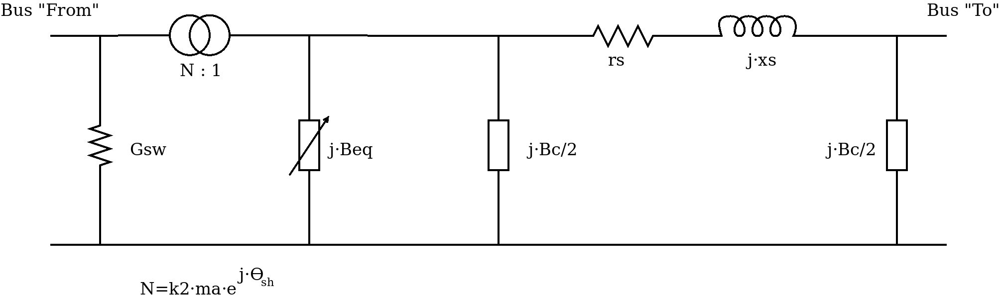

Flujo de potencia AC/DC unificado (FUBM)
=========================================

Introducción
---------------

El modelo AC/DC unificado (FUBM: Flexible Unified Branch Model) fué desarrollado
en [FUBM1]_ y [FUBM2]_

El modelo general considera que todas las ramas de un sistema de potencia se pueden represnetar por el siguiente
esquema:

Sistema de ecuaciones
------------------------

.. math::
    \left[
        \begin{matrix}
        \Delta Va  \\
        \Delta Vm  \\
        \Delta \theta_{sh}  \\
        \Delta m_a  \\
        \Delta B_{eq}  \\
        \Delta B_{eq}   \\
        \Delta m_a  \\
        \Delta m_a  \\
        \Delta \theta_{sh}
        \end{matrix}
    \right] = \left[
        \begin{matrix}
        J11 & J12 & J13 & J14 & J15 & J16 & J17 & J18 & J19 \\
        J21 & J22 & J23 & J24 & J25 & J26 & J27 & J28 & J29 \\
        J31 & J32 & J33 & J34 & J35 & J36 & J37 & J38 & J39 \\
        J41 & J42 & J43 & J44 & J45 & J46 & J47 & J48 & J49 \\
        J51 & J52 & J53 & J54 & J55 & J56 & J57 & J58 & J59 \\
        J61 & J62 & J63 & J64 & J65 & J66 & J67 & J68 & J69 \\
        J71 & J72 & J73 & J74 & J75 & J76 & J77 & J78 & J79 \\
        J81 & J82 & J83 & J84 & J85 & J86 & J87 & J88 & J89 \\
        J91 & J92 & J93 & J94 & J95 & J96 & J97 & J98 & J99
        \end{matrix}
    \right]^{-1}  \times \left[
        \begin{matrix}
        \Delta P \\
        \Delta Q  \\
        \Delta Pfsh  \\
        \Delta Qfma  \\
        \Delta Beqz  \\
        \Delta Beqv  \\
        \Delta Vtma  \\
        \Delta Qtma  \\
        \Delta Pfdp
        \end{matrix}
    \right]

Si vemos las derivadas que corponden a cada sub-matriz del Jacobiano, observamos que podemos
dar un orden contiguo a las variables para que el sistema se computacionalmente mas eficiente
al montar la matriz:

.. math::
    \left[
        \begin{matrix}
        \Delta Va  \\
        \Delta Vm  \\
        \Delta B_{eq}   \\
        \Delta m_a  \\
        \Delta \theta_{sh}  \\
        \Delta m_a  \\
        \Delta B_{eq}  \\
        \Delta m_a  \\
        \Delta \theta_{sh}
        \end{matrix}
    \right] = \left[
        \begin{matrix}
        \Re\left\{\frac{\partial Sbus}{\partial Va}\right\}_{[pvpq,pvpq]} &
        \Re\left\{\frac{\partial Sbus}{\partial Vm}\right\}_{[pvpq, pq]} &
        \Re\left\{\frac{\partial Sbus}{\partial Pfsh} \right\}_{[pvpq,:]} &
        \Re\left\{\frac{\partial Sbus}{\partial Qfma}\right\}_{[pvpq,:]} &
        \Re\left\{\frac{\partial Sbus}{\partial Beqz}\right\}_{[pvpq,:]} &
        \Re\left\{\frac{\partial Sbus}{\partial Beqv}\right\}_{[pvpq,:]} &
        \Re\left\{\frac{\partial Sbus}{\partial Vtma}\right\}_{[pvpq,:]} &
        \Re\left\{\frac{\partial Sbus}{\partial Qtma}\right\}_{[pvpq,:]} &
        \Re\left\{\frac{\partial Sbus}{\partial Pfdp}\right\}_{[pvpq,:]}
        \\
        \Im\left\{\frac{\partial Sbus}{\partial Va}\right\}_{[pq, pvpq]} &
        \Im\left\{\frac{\partial Sbus}{\partial Vm}\right\}_{[pq, pq]} &
        \Im\left\{\frac{\partial Sbus}{\partial Pfsh}\right\}_{[pq,:]} &
        \Im\left\{\frac{\partial Sbus}{\partial Qfma}\right\}_{[pq,:]} &
        \Im\left\{\frac{\partial Sbus}{\partial Beqz}\right\}_{[pq,:]} &
        \Im\left\{\frac{\partial Sbus}{\partial Beqv}\right\}_{[pq,:]} &
        \Im\left\{\frac{\partial Sbus}{\partial Vtma}\right\}_{[pq,:]} &
        \Im\left\{\frac{\partial Sbus}{\partial Qtma}\right\}_{[pq,:]} &
        \Im\left\{\frac{\partial Sbus}{\partial Pfdp}\right\}_{[pq,:]}
        \\
        \Im\left\{\frac{\partial Sbus}{\partial Va}\right\}_{[iVfBeqbus,pvpq]} &
        \Im\left\{\frac{\partial Sbus}{\partial Vm}\right\}_{[iVfBeqbus,pq]} &
        \Im\left\{\frac{\partial Sbus}{\partial Pfsh}\right\}_{[iVfBeqbus,:]} &
        \Im\left\{\frac{\partial Sbus}{\partial Qfma}\right\}_{[iVfBeqbus,:]} &
        \Im\left\{\frac{\partial Sbus}{\partial Beqz}\right\}_{[iVfBeqbus,:]} &
        \Im\left\{\frac{\partial Sbus}{\partial Beqv}\right\}_{[iVfBeqbus,:]} &
        \Im\left\{\frac{\partial Sbus}{\partial Vtma}\right\}_{[iVfBeqbus,:]} &
        \Im\left\{\frac{\partial Sbus}{\partial Qtma}\right\}_{[iVfBeqbus,:]} &
        \Im\left\{\frac{\partial Sbus}{\partial Pfdp}\right\}_{[iVfBeqbus,:]}
        \\
        \Im\left\{\frac{\partial Sbus}{\partial Va}\right\}_{[iVtmabus,pvpq]} &
        \Im\left\{\frac{\partial Sbus}{\partial Vm}\right\}_{[iVtmabus,pq]} &
        \Im\left\{\frac{\partial Sbus}{\partial Pfsh}\right\}_{[iVtmabus,:]} &
        \Im\left\{\frac{\partial Sbus}{\partial Qfma}\right\}_{[iVtmabus,:]} &
        \Im\left\{\frac{\partial Sbus}{\partial Beqz}\right\}_{[iVtmabus,:]} &
        \Im\left\{\frac{\partial Sbus}{\partial Beqv}\right\}_{[iVtmabus,:]} &
        \Im\left\{\frac{\partial Sbus}{\partial Vtma}\right\}_{[iVtmabus,:]} &
        \Im\left\{\frac{\partial Sbus}{\partial Qtma}\right\}_{[iVtmabus,:]} &
        \Im\left\{\frac{\partial Sbus}{\partial Pfdp}\right\}_{[iVtmabus,:]}
        \\
        \Re\left\{\frac{\partial Sf}{\partial Va}\right\}_{[iPfsh,pvpq]} &
        \Re\left\{\frac{\partial Sf}{\partial Vm}\right\}_{[iPfsh,pq]} &
        \Re\left\{\frac{\partial Sf}{\partial Pfsh}\right\}_{[iPfsh,:]} &
        \Re\left\{\frac{\partial Sf}{\partial Qfma}\right\}_{[iPfsh,:]} &
        \Re\left\{\frac{\partial Sf}{\partial Beqz}\right\}_{[iPfsh,:]} &
        \Re\left\{\frac{\partial Sf}{\partial Beqv}\right\}_{[iPfsh,:]} &
        \Re\left\{\frac{\partial Sf}{\partial Vtma}\right\}_{[iPfsh,:]} &
        \Re\left\{\frac{\partial Sf}{\partial Qtma}\right\}_{[iPfsh,:]} &
        \Re\left\{\frac{\partial Sf}{\partial Pfdp}\right\}_{[iPfsh,:]}
        \\
        \Im\left\{\frac{\partial Sf}{\partial Va}\right\}_{[iQfma,pvpq]} &
        \Im\left\{\frac{\partial Sf}{\partial Vm}\right\}_{[iQfma,pq]} &
        \Im\left\{\frac{\partial Sf}{\partial Pfsh}\right\}_{[iQfma,:]} &
        \Im\left\{\frac{\partial Sf}{\partial Qfma}\right\}_{[iQfma,:]} &
        \Im\left\{\frac{\partial Sf}{\partial Beqz}\right\}_{[iQfma,:]} &
        \Im\left\{\frac{\partial Sf}{\partial Beqv}\right\}_{[iQfma,:]} &
        \Im\left\{\frac{\partial Sf}{\partial Vtma}\right\}_{[iQfma,:]} &
        \Im\left\{\frac{\partial Sf}{\partial Qtma}\right\}_{[iQfma,:]} &
        \Im\left\{\frac{\partial Sf}{\partial Pfdp}\right\}_{[iQfma,:]}
        \\
        \Im\left\{\frac{\partial Sf}{\partial Va}\right\}_{[iBeqz,pvpq]} &
        \Im\left\{\frac{\partial Sf}{\partial Vm}\right\}_{[iBeqz,pq]} &
        \Im\left\{\frac{\partial Sf}{\partial Pfsh}\right\}_{[iBeqz,:]} &
        \Im\left\{\frac{\partial Sf}{\partial Qfma}\right\}_{[iBeqz,:]} &
        \Im\left\{\frac{\partial Sf}{\partial Beqz}\right\}_{[iBeqz,:]} &
        \Im\left\{\frac{\partial Sf}{\partial Beqv}\right\}_{[iBeqz,:]} &
        \Im\left\{\frac{\partial Sf}{\partial Vtma}\right\}_{[iBeqz,:]} &
        \Im\left\{\frac{\partial Sf}{\partial Qtma}\right\}_{[iBeqz,:]} &
        \Im\left\{\frac{\partial Sf}{\partial Pfdp}\right\}_{[iBeqz,:]}
        \\
        \Im\left\{\frac{\partial St}{\partial Va}\right\}_{[iQtma,pvpq]} &
        \Im\left\{\frac{\partial St}{\partial Vm}\right\}_{[iQtma,pq]} &
        \Im\left\{\frac{\partial St}{\partial Pfsh}\right\}_{[iQtma,:]} &
        \Im\left\{\frac{\partial St}{\partial Qfma}\right\}_{[iQtma,:]} &
        \Im\left\{\frac{\partial St}{\partial Beqz}\right\}_{[iQtma,:]} &
        \Im\left\{\frac{\partial St}{\partial Beqv}\right\}_{[iQtma,:]} &
        \Im\left\{\frac{\partial St}{\partial Vtma}\right\}_{[iQtma,:]} &
        \Im\left\{\frac{\partial St}{\partial Qtma}\right\}_{[iQtma,:]} &
        \Im\left\{\frac{\partial St}{\partial Pfdp}\right\}_{[iQtma,:]}
        \\
        \frac{\partial Pfdp}{\partial Va}_{[iPfdp, pvpq]} &
        \frac{\partial Pfdp}{\partial Vm}_{[iPfdp,pq]} &
        \frac{\partial Pfdp}{\partial Pfsh}_{[iPfdp,:]} &
        \frac{\partial Pfdp}{\partial Qfma}_{[iPfdp,:]} &
        \frac{\partial Pfdp}{\partial Beqz}_{[iPfdp,:]} &
        \frac{\partial Pfdp}{\partial Beqv}_{[iPfdp,:]} &
        \frac{\partial Pfdp}{\partial Vtma}_{[iPfdp,:]} &
        \frac{\partial Pfdp}{\partial Qtma}_{[iPfdp,:]} &
        \frac{\partial Pfdp}{\partial Pfdp}_{[iPfdp,:]}
        \end{matrix}
    \right]^{-1}  \times \left[
        \begin{matrix}
        \Delta P \\
        \Delta Q  \\
        \Delta Pfsh  \\
        \Delta Qfma  \\
        \Delta Beqz  \\
        \Delta Beqv  \\
        \Delta Vtma  \\
        \Delta Qtma  \\
        \Delta Pfdp
        \end{matrix}
    \right]

Vector de error
---------------------------

.. math::

    \Delta P  = \Re \left\{\Delta S_{[pvpq]}\right\}

    \Delta Q  = \Im \left\{\Delta S_{[pq]}\right\}

    \Delta Pfsh = \Re \left\{Sf_{[iPfsh]}\right\} - Pfset_{[iPfsh]}

    \Delta Qfma = \Im \left\{Sf_{[iQfma]}\right\} - Qfset_{[iQfma]}

    \Delta Beqz  = \Im \left\{Sf_{[iBeqz]}\right\} - 0

    \Delta Beqv  = \Im \left\{\Delta S_{[VfBeqbus]}\right\}

    \Delta Vtma  = \Im \left\{\Delta S_{[Vtmabus]}\right\}

    \Delta Qtma  = \Im \left\{St_{[iQtma]}\right\} - Qtset_{[iQtma]}

    \Delta Pfdp  = -\Re \left\{Sf_{[iPfdp]}\right\} + Pfset_{[iPfdp]} + Kdp_{[iPfdp]} \cdot ( Vm_{[busF_{[iPfdp]}]} - Vmfset_{[iPfdp]} )

Dónde:

.. math::

    \Delta S = V \cdot (Ybus \times V)^{*} - Sbus(Vm)

Jacobiano
--------------

.. math::

    j11 = \Re\left\{\frac{\partial Sbus}{\partial Va}\right\} [pvpq,pvpq]

    j12 = \Re\left\{\frac{\partial Sbus}{\partial Vm}\right\}[pvpq, pq]

    j13 = \Re\left\{\frac{\partial Sbus}{\partial Pfsh} \right\}[pvpq,:]

    j14 = \Re\left\{\frac{\partial Sbus}{\partial Qfma}\right\}[pvpq,:]

    j15 = \Re\left\{\frac{\partial Sbus}{\partial Beqz}\right\}[pvpq,:]

    j16 = \Re\left\{\frac{\partial Sbus}{\partial Beqv}\right\}[pvpq,:]

    j17 = \Re\left\{\frac{\partial Sbus}{\partial Vtma}\right\}[pvpq,:]

    j18 = \Re\left\{\frac{\partial Sbus}{\partial Qtma}\right\}[pvpq,:]

    j19 = \Re\left\{\frac{\partial Sbus}{\partial Pfdp}\right\}_{[pvpq,:]}

.. math::

    j21 = \Im\left\{\frac{\partial Sbus}{\partial Va}\right\}[pq, pvpq]]

    j22 = \Im\left\{\frac{\partial Sbus}{\partial Vm}\right\}[pq, pq]

    j23 = \Im\left\{\frac{\partial Sbus}{\partial Pfsh}\right\}[pq,:]

    j24 = \Im\left\{\frac{\partial Sbus}{\partial Qfma}\right\}[pq,:]

    j25 = \Im\left\{\frac{\partial Sbus}{\partial Beqz}\right\}[pq,:]

    j26 = \Im\left\{\frac{\partial Sbus}{\partial Beqv}\right\}[pq,:]

    j27 = \Im\left\{\frac{\partial Sbus}{\partial Vtma}\right\}[pq,:]

    j28 = \Im\left\{\frac{\partial Sbus}{\partial Qtma}\right\}[pq,:]

    j29 = \Im\left\{\frac{\partial Sbus}{\partial Pfdp}\right\}[pq,:]

Only Pf control elements iPfsh:

.. math::

    j31 = \Re\left\{\frac{\partial Sf}{\partial Va}\right\}[iPfsh,pvpq]

    j32 = \Re\left\{\frac{\partial Sf}{\partial Vm}\right\}[iPfsh,pq]

    j33 = \Re\left\{\frac{\partial Sf}{\partial Pfsh}\right\}[iPfsh,:]

    j34 = \Re\left\{\frac{\partial Sf}{\partial Qfma}\right\}[iPfsh,:]

    j35 = \Re\left\{\frac{\partial Sf}{\partial Beqz}\right\}[iPfsh,:]

    j36 = \Re\left\{\frac{\partial Sf}{\partial Beqv}\right\}[iPfsh,:]

    j37 = \Re\left\{\frac{\partial Sf}{\partial Vtma}\right\}[iPfsh,:]

    j38 = \Re\left\{\frac{\partial Sf}{\partial Qtma}\right\}[iPfsh,:]

    j39 = \Re\left\{\frac{\partial Sf}{\partial Pfdp}\right\}[iPfsh,:]

Only Qf control elements iQfma:

.. math::

    j41 = \Im\left\{\frac{\partial Sf}{\partial Va}\right\}[iQfma,pvpq]

    j42 = \Im\left\{\frac{\partial Sf}{\partial Vm}\right\}[iQfma,pq]

    j43 = \Im\left\{\frac{\partial Sf}{\partial Pfsh}\right\}[iQfma,:]

    j44 = \Im\left\{\frac{\partial Sf}{\partial Qfma}\right\}[iQfma,:]

    j45 = \Im\left\{\frac{\partial Sf}{\partial Beqz}\right\}[iQfma,:]

    j46 = \Im\left\{\frac{\partial Sf}{\partial Beqv}\right\}[iQfma,:]

    j47 = \Im\left\{\frac{\partial Sf}{\partial Vtma}\right\}[iQfma,:]

    j48 = \Im\left\{\frac{\partial Sf}{\partial Qtma}\right\}[iQfma,:]

    j49 = \Im\left\{\frac{\partial Sf}{\partial Pfdp}\right\}[iQfma,:]

Only Qf control elements iQfbeq:

.. math::

    j51 = \Im\left\{\frac{\partial Sf}{\partial Va}\right\}[iBeqz,pvpq]

    j52 = \Im\left\{\frac{\partial Sf}{\partial Vm}\right\}[iBeqz,pq]

    j53 = \Im\left\{\frac{\partial Sf}{\partial Pfsh}\right\}[iBeqz,:]

    j54 = \Im\left\{\frac{\partial Sf}{\partial Qfma}\right\}[iBeqz,:]

    j55 = \Im\left\{\frac{\partial Sf}{\partial Beqz}\right\}[iBeqz,:]

    j56 = \Im\left\{\frac{\partial Sf}{\partial Beqv}\right\}[iBeqz,:]

    j57 = \Im\left\{\frac{\partial Sf}{\partial Vtma}\right\}[iBeqz,:]

    j58 = \Im\left\{\frac{\partial Sf}{\partial Qtma}\right\}[iBeqz,:]

    j59 = \Im\left\{\frac{\partial Sf}{\partial Pfdp}\right\}[iBeqz,:]

Only Vf control elements iVfbeq:

.. math::

    j61 = \Im\left\{\frac{\partial Sbus}{\partial Va}\right\}[VfBeqbus,pvpq]

    j62 = \Im\left\{\frac{\partial Sbus}{\partial Vm}\right\}[VfBeqbus,pq]

    j63 = \Im\left\{\frac{\partial Sbus}{\partial Pfsh}\right\}[VfBeqbus,:]

    j64 = \Im\left\{\frac{\partial Sbus}{\partial Qfma}\right\}[VfBeqbus,:]

    j65 = \Im\left\{\frac{\partial Sbus}{\partial Beqz}\right\}[VfBeqbus,:]

    j66 = \Im\left\{\frac{\partial Sbus}{\partial Beqv}\right\}[VfBeqbus,:]

    j67 = \Im\left\{\frac{\partial Sbus}{\partial Vtma}\right\}[VfBeqbus,:]

    j68 = \Im\left\{\frac{\partial Sbus}{\partial Qtma}\right\}[VfBeqbus,:]

    j69 = \Im\left\{\frac{\partial Sbus}{\partial Pfdp}\right\}[VfBeqbus,:]

Only Vt control elements iVtma:

.. math::

    j71 = \Im\left\{\frac{\partial Sbus}{\partial Va}\right\}[Vtmabus,pvpq]

    j72 = \Im\left\{\frac{\partial Sbus}{\partial Vm}\right\}[Vtmabus,pq]

    j73 = \Im\left\{\frac{\partial Sbus}{\partial Pfsh}\right\}[Vtmabus,:]

    j74 = \Im\left\{\frac{\partial Sbus}{\partial Qfma}\right\}[Vtmabus,:]

    j75 = \Im\left\{\frac{\partial Sbus}{\partial Beqz}\right\}[Vtmabus,:]

    j76 = \Im\left\{\frac{\partial Sbus}{\partial Beqv}\right\}[Vtmabus,:]

    j77 = \Im\left\{\frac{\partial Sbus}{\partial Vtma}\right\}[Vtmabus,:]

    j78 = \Im\left\{\frac{\partial Sbus}{\partial Qtma}\right\}[Vtmabus,:]

    j79 = \Im\left\{\frac{\partial Sbus}{\partial Pfdp}\right\}[Vtmabus,:]

Only Qt control elements iQtma:

.. math::

    j81 = \Im\left\{\frac{\partial St}{\partial Va}\right\}[iQtma,pvpq]

    j82 = \Im\left\{\frac{\partial St}{\partial Vm}\right\}[iQtma,pq]

    j83 = \Im\left\{\frac{\partial St}{\partial Pfsh}\right\}[iQtma,:]

    j84 = \Im\left\{\frac{\partial St}{\partial Qfma}\right\}[iQtma,:]

    j85 = \Im\left\{\frac{\partial St}{\partial Beqz}\right\}[iQtma,:]

    j86 = \Im\left\{\frac{\partial St}{\partial Beqv}\right\}[iQtma,:]

    j87 = \Im\left\{\frac{\partial St}{\partial Vtma}\right\}[iQtma,:]

    j88 = \Im\left\{\frac{\partial St}{\partial Qtma}\right\}[iQtma,:]

    j89 = \Im\left\{\frac{\partial St}{\partial Pfdp}\right\}[iQtma,:]

Only Droop control elements iPfdp:

.. math::

    j91 =  \frac{\partial Pfdp}{\partial Va}[iPfdp, pvpq]

    j92 =  \frac{\partial Pfdp}{\partial Vm}[iPfdp,pq]

    j93 =  \frac{\partial Pfdp}{\partial Pfsh}[iPfdp,:]

    j94 =  \frac{\partial Pfdp}{\partial Qfma}[iPfdp,:]

    j95 =  \frac{\partial Pfdp}{\partial Beqz}[iPfdp,:]

    j96 =  \frac{\partial Pfdp}{\partial Beqv}[iPfdp,:]

    j97 =  \frac{\partial Pfdp}{\partial Vtma}[iPfdp,:]

    j98 =  \frac{\partial Pfdp}{\partial Qtma}[iPfdp,:]

    j99 =  \frac{\partial Pfdp}{\partial Pfdp}[iPfdp,:]

Derivadas
------------------

Derivadas necesarias:

.. math::

    \frac{\partial Y}{\partial Pfsh} = ...

Derivadas de potencias nodales:

.. math::

    \frac{\partial Sbus}{\partial Va} = j[V] \times (Y \times [V])^* + [V] \times (Y \times j[V])^*

    \frac{\partial Sbus}{\partial Vm} = [E] \times (Y \times [V])^* + [V] \times (Y \times [E])^*

    \frac{\partial Sbus}{\partial Pfsh} = [V] \times \left( \frac{\partial Y}{\partial Pfsh}  \times [V]\right)^*

    \frac{\partial Sbus}{\partial Qfma} = ...

    \frac{\partial Sbus}{\partial Beqz} = ...

    \frac{\partial Sbus}{\partial Beqv} = ...

    \frac{\partial Sbus}{\partial Vtma} = ...

    \frac{\partial Sbus}{\partial Qtma} = ...

    \frac{\partial Sbus}{\partial Pfdp} = ...

Derivadas de potencias de rama desde el lado "from":

.. math::

    \frac{\partial Sf}{\partial Va} = ...

    \frac{\partial Sf}{\partial Vm}\ = ...

    \frac{\partial Sf}{\partial Pfsh} = ...

    \frac{\partial Sf}{\partial Qfma} = ...

    \frac{\partial Sf}{\partial Beqz} = ...

    \frac{\partial Sf}{\partial Beqv} = ...

    \frac{\partial Sf}{\partial Vtma} = ...

    \frac{\partial Sf}{\partial Qtma} = ...

    \frac{\partial Sf}{\partial Pfdp} = ...

Derivadas de potencias de rama desde el lado "to":

.. math::

    \frac{\partial St}{\partial Va} = ...

    \frac{\partial St}{\partial Vm} = ...

    \frac{\partial St}{\partial Pfsh} = ...

    \frac{\partial St}{\partial Qfma} = ...

    \frac{\partial St}{\partial Beqz} = ...

    \frac{\partial St}{\partial Beqv} = ...

    \frac{\partial St}{\partial Vtma} = ...

    \frac{\partial St}{\partial Qtma} = ...

    \frac{\partial St}{\partial Pfdp} = ...

Derivadas de la potencia "droop":

.. math::

    \frac{\partial Pfdp}{\partial Va} = -\Re\left\{\frac{\partial Sf}{\partial Va}\right\}

    \frac{\partial Pfdp}{\partial Vm} = -\Re\left\{\frac{\partial Sf}{\partial Vm}\right\} + diag(Kdp) \times Cf

    \frac{\partial Pfdp}{\partial Pfsh} = -\Re\left\{\frac{\partial Sf}{\partial Pfsh}\right\}

    \frac{\partial Pfdp}{\partial Qfma} = -\Re\left\{\frac{\partial Sf}{\partial Qtma}\right\}

    \frac{\partial Pfdp}{\partial Beqz} = -\Re\left\{\frac{\partial Sf}{\partial Beqz}\right\}

    \frac{\partial Pfdp}{\partial Beqv} = -\Re\left\{\frac{\partial Sf}{\partial Beqv}\right\}

    \frac{\partial Pfdp}{\partial Vtma} = -\Re\left\{\frac{\partial Sf}{\partial Vtma}\right\}

    \frac{\partial Pfdp}{\partial Qtma} = -\Re\left\{\frac{\partial Sf}{\partial Qtma}\right\}

    \frac{\partial Pfdp}{\partial Pfdp} = -\Re\left\{\frac{\partial Sf}{\partial Pfdp}\right\}

.. [FUBM1] Flexible General Branch Model Unified Power Flow Algorithm for future flexible AC/DC Networks,
            Abraham Álavarez Bustos and Behzah Kazemtabrizi, IEEE, 2018

.. [FUBM2] Universal branch model for the solution of optimal power flows in hybrid AC/DC grids,
           Abraham Álavarez Bustos, Behzah Kazemtabrizi, Mahmoud Shahbazi and Enrique Acha-Daza,
           International Journal of Electrical and power and Energy Systems, 2021